# tunnel-rs Architecture: Port Forwarding

This document covers the port-forwarding modes (iroh, manual, nostr).
See `docs/ARCHITECTURE.md` for common architecture components.

## iroh Mode

### Architecture Overview

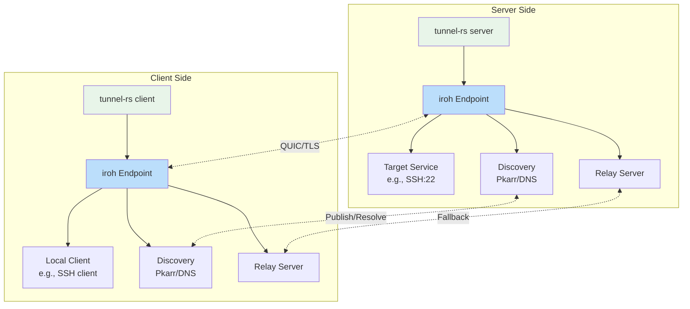

### Connection Establishment Flow

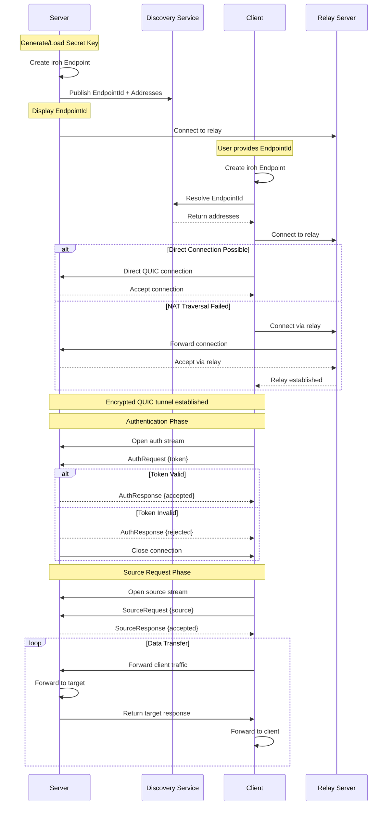

### TCP Tunnel Data Flow

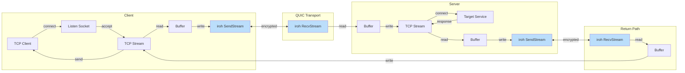

### UDP Tunnel Data Flow

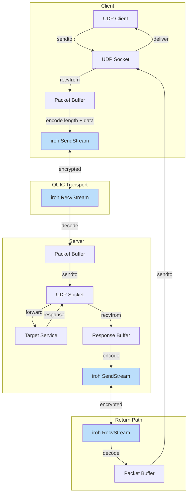

### Endpoint Management

```mermaid
graph TB
    subgraph "Endpoint Creation"
        A[Load/Generate Secret] --> B[Create Endpoint Builder]
        B --> C{Relay URLs?}
        C -->|Yes| D[Add Custom Relays]
        C -->|No| E[Use Default Relays]
        D --> F{Relay Only? (CLI-only)}
        E --> F
        F -->|Yes| G[Disable IP transports]
        F -->|No| H[Keep IP + relay transports]
        G --> I{DNS Server?}
        H --> I
        I -->|Yes| J[Add Custom DNS]
        I -->|No| K[Use Default DNS]
        J --> L[Build Endpoint]
        K --> L
    end
    
    subgraph "Discovery"
        L --> M[Publish to Pkarr/DNS]
        M --> N[Enable mDNS]
        N --> O[Endpoint Ready]
    end
    
    style A fill:#FFE0B2
    style L fill:#C8E6C9
    style O fill:#C8E6C9
```

---

## manual Mode

> **Note:** manual mode implements full ICE with STUN-only connectivity checks. TURN/relay servers are not implemented. This means symmetric NAT peers may still fail to establish a connection without a relay fallback mechanism.

### Architecture Overview

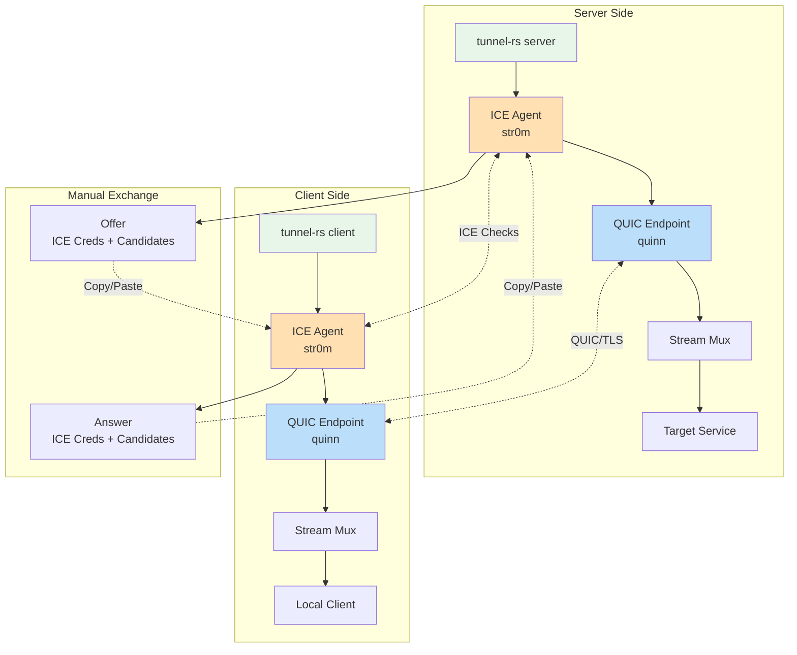

### Full ICE + QUIC Stack

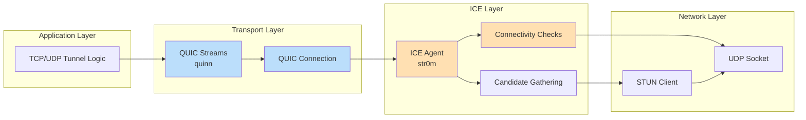

### ICE Candidate Gathering

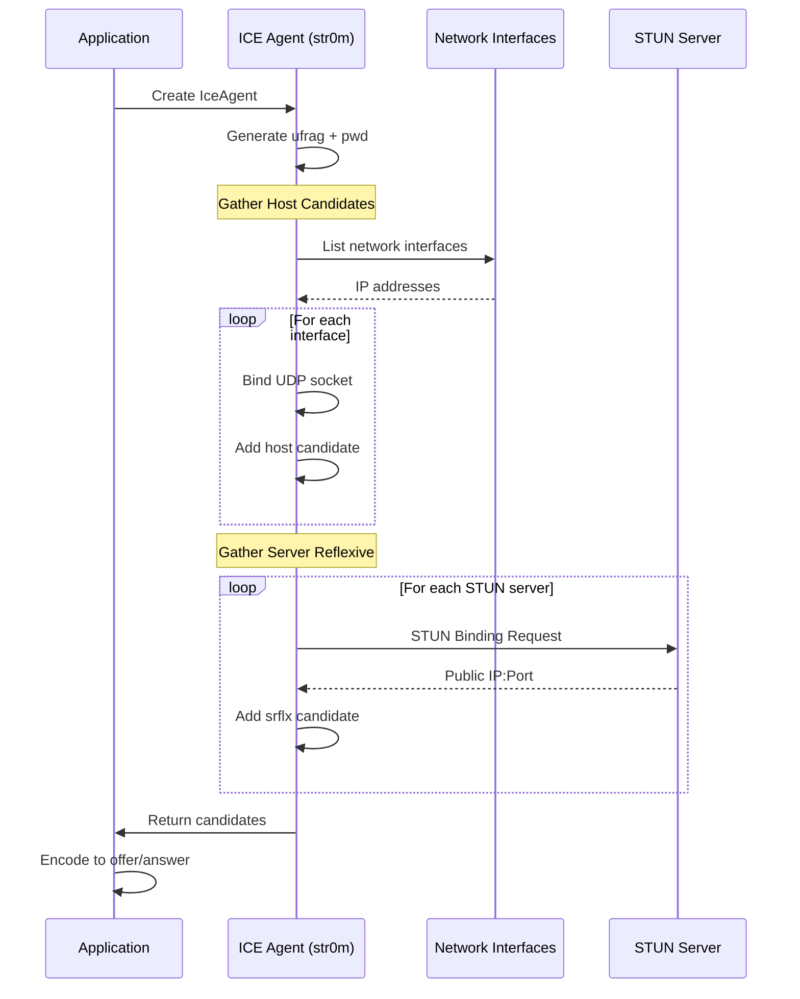

### ICE Connectivity Checks

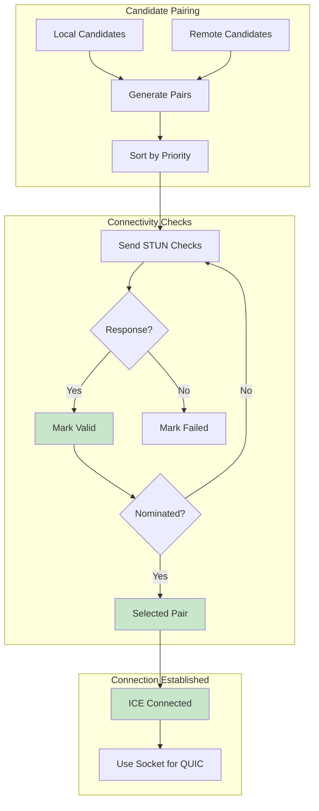

### Signaling Flow (Custom Mode)

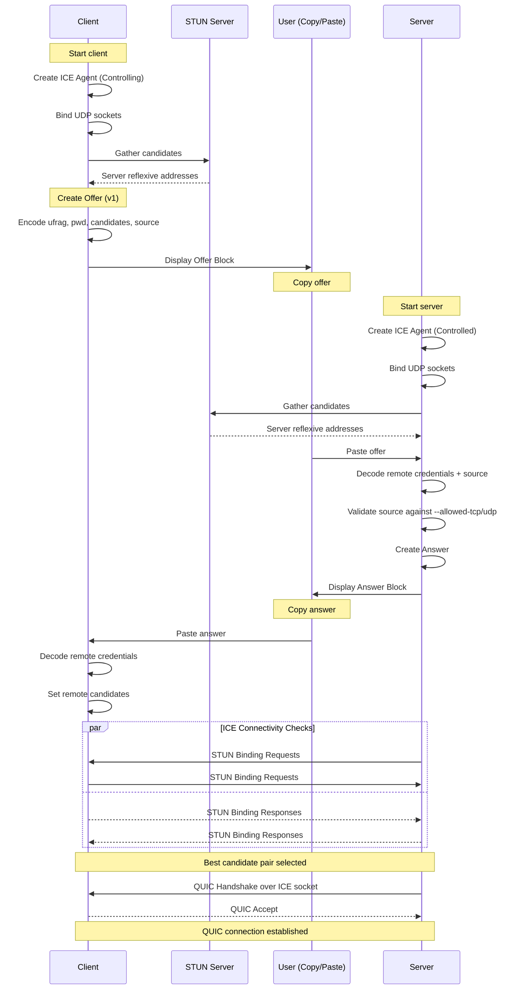

### QUIC Over ICE Socket

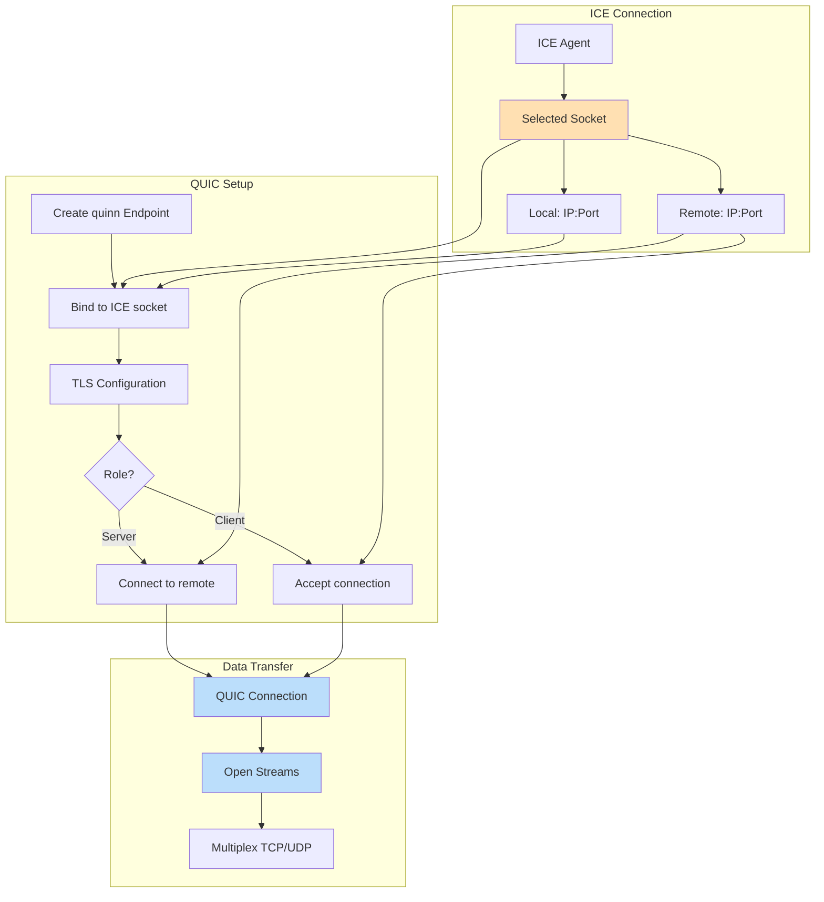

### Stream Multiplexing

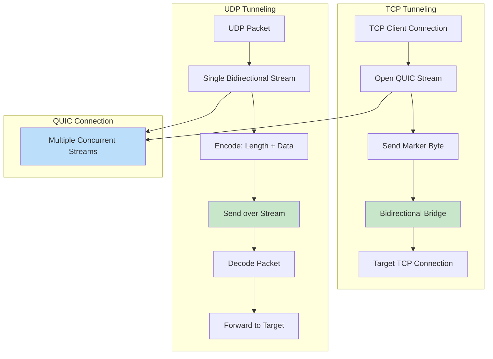

### Connection Type Detection

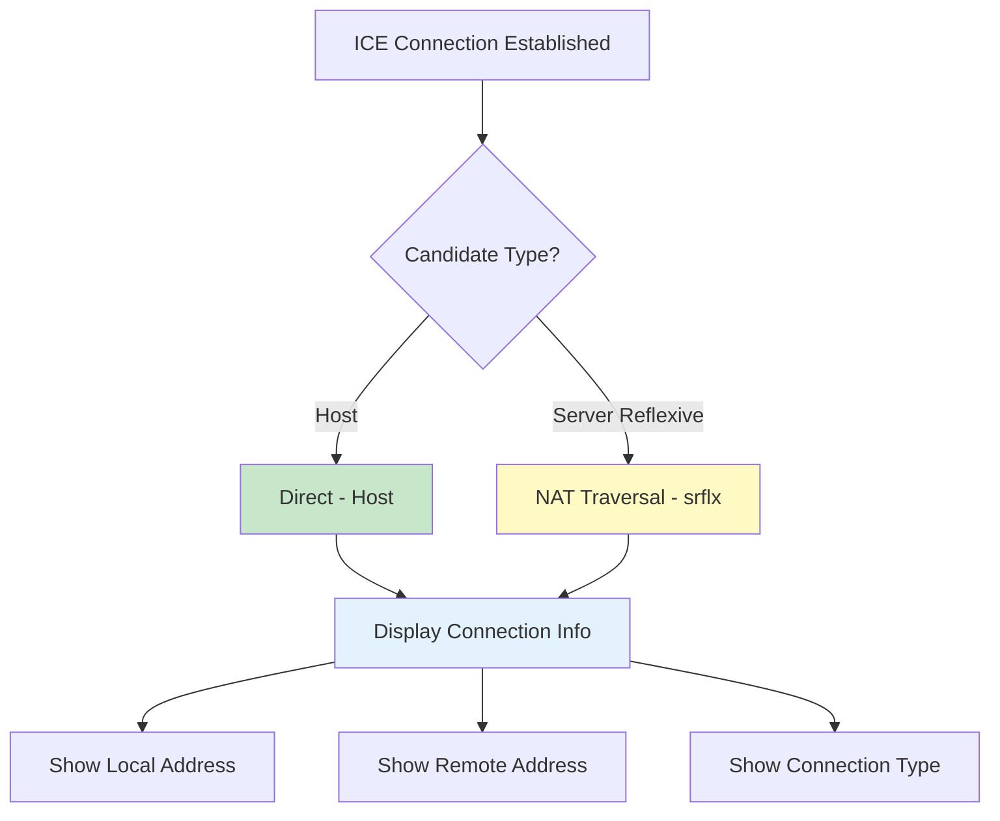

---

## nostr Mode

Nostr mode combines the full ICE implementation from manual mode with automated signaling via Nostr relays. Instead of manual copy-paste, ICE credentials are exchanged through Nostr events using static keypairs.

> **Note for Containerized Environments:** Like manual mode, nostr mode uses STUN-only NAT traversal without relay fallback. If both peers are behind restrictive NATs (common in Docker, Kubernetes, or cloud VMs), ICE connectivity may fail. For containerized deployments, consider using `iroh` mode which includes automatic relay fallback.

### Client-Initiated Dynamic Source

All modes use a **client-initiated** model for consistent UX:

- **Server**: Whitelists allowed networks with `--allowed-tcp`/`--allowed-udp` (CIDR notation)
- **Client**: Specifies which service to tunnel with `--source` (hostname:port)

This is similar to SSH's `-L` flag for local port forwarding, where the client chooses the destination.

```
Server: --allowed-tcp 10.0.0.0/8           # Whitelist networks (no ports)
Client: --source tcp://postgres:5432       # Request specific service
        --target 127.0.0.1:5432            # Local listen address
```

### Architecture Overview

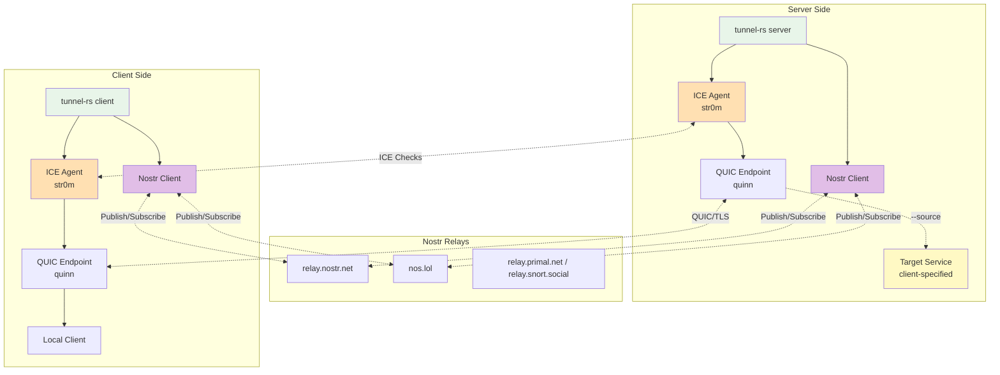

### Client-First Signaling Flow

Nostr mode uses a client-first protocol where the client initiates the signaling exchange. This allows the server to wait for clients to come online.

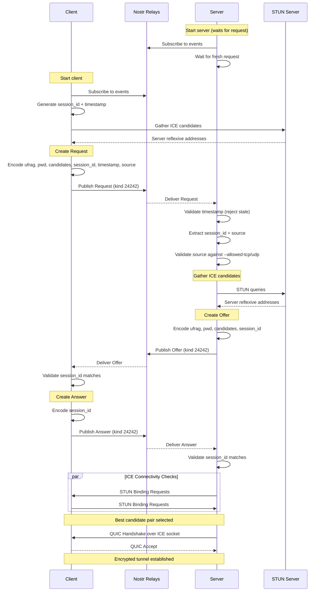

### Session ID and Stale Event Filtering

Nostr events persist on relays, so tunnel-rs uses session IDs and timestamps to filter stale events from previous sessions:

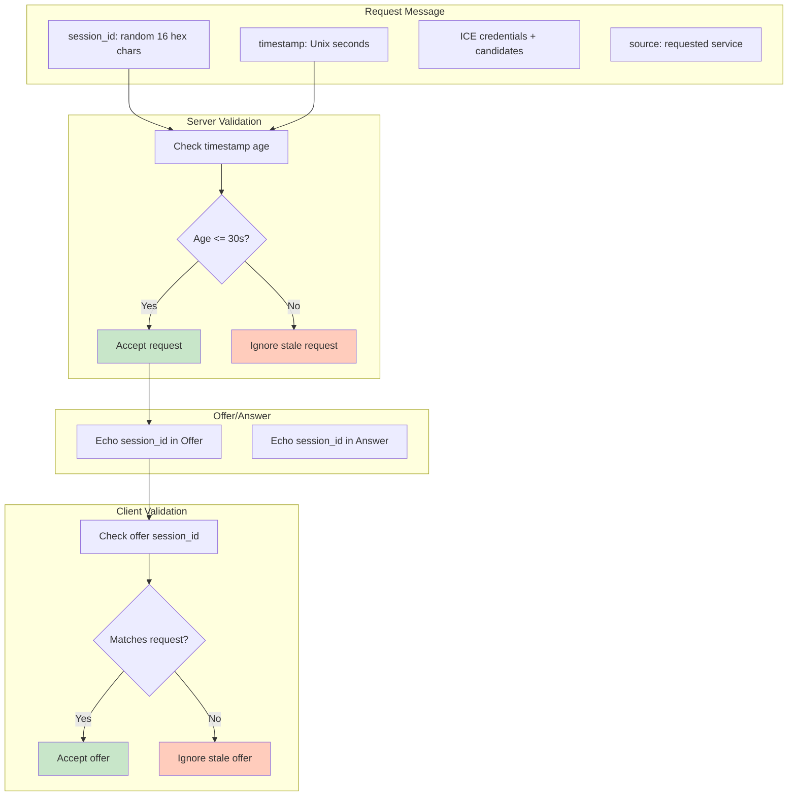

### Nostr Event Structure

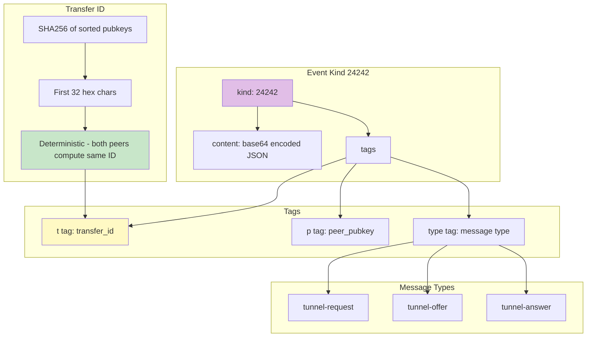

---
