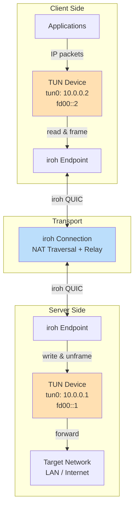
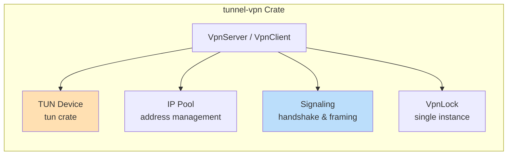
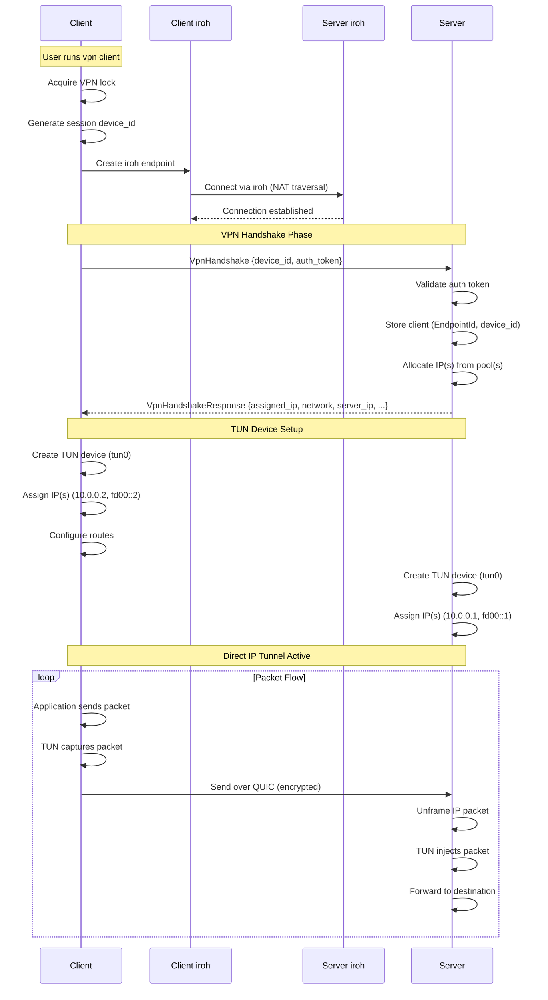
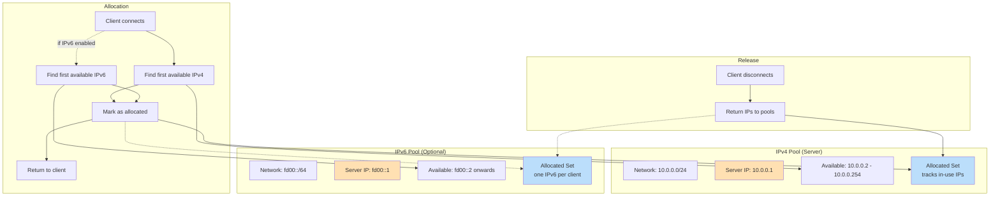
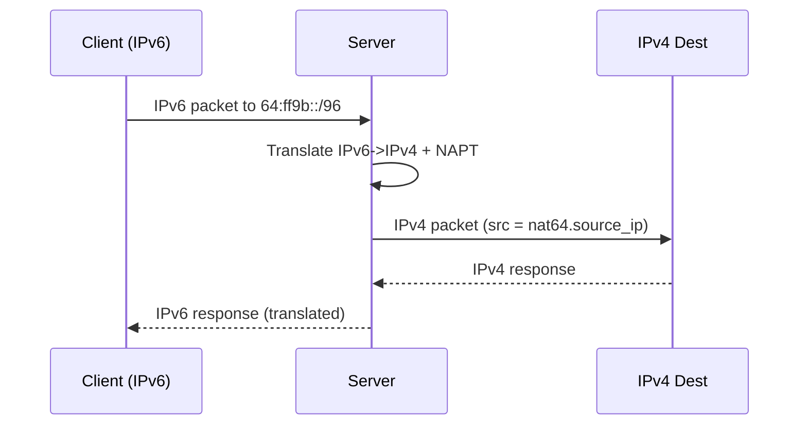
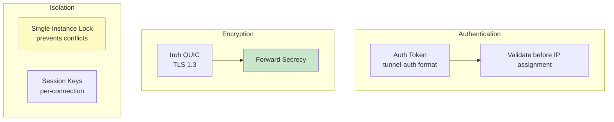
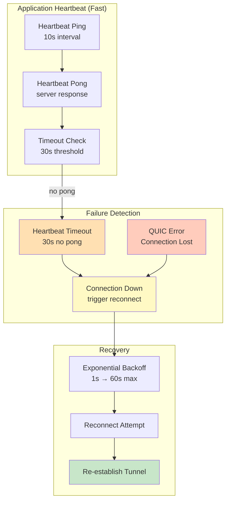
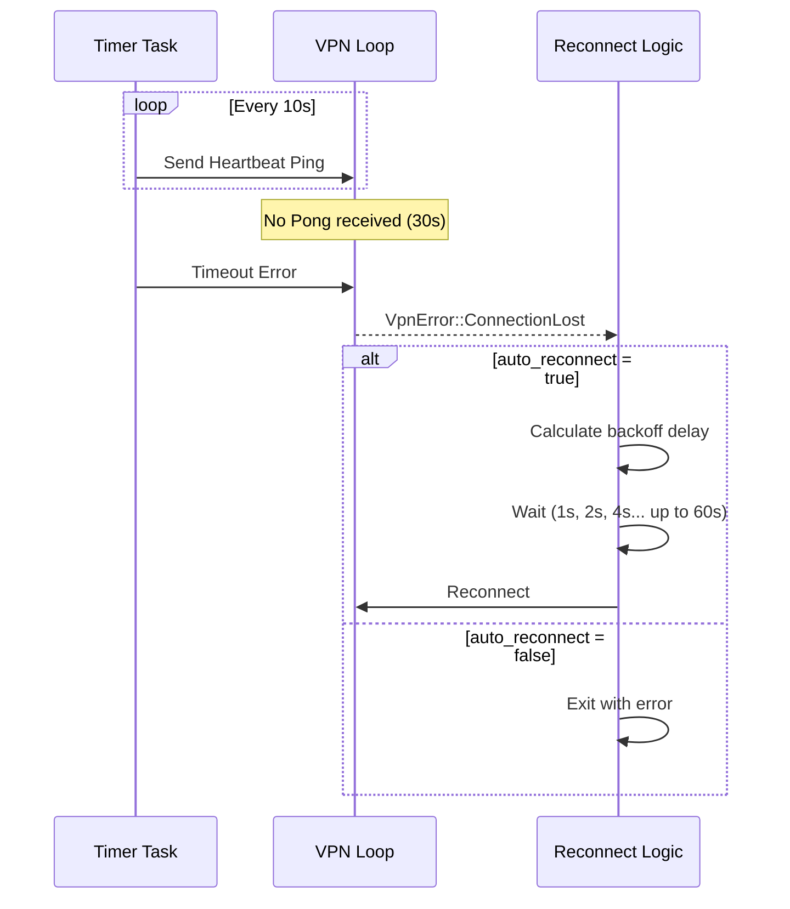

# tunnel-rs Architecture: VPN

This document covers VPN mode architecture, including NAT64.
See `docs/ARCHITECTURE.md` for common architecture components.

## VPN Mode

VPN mode provides full network tunneling using direct IP-over-QUIC. Unlike port forwarding modes, VPN mode creates a TUN device and routes IP traffic directly through the encrypted Iroh QUIC connection. This eliminates double encryption overhead while maintaining strong security via TLS 1.3.

> **Note:** VPN mode requires root/admin privileges. On Windows, you also need `wintun.dll` from https://www.wintun.net/ (official WireGuard project) — download the zip, extract, and copy `wintun/bin/amd64/wintun.dll` to the same directory as the executable (or any directory in the system PATH).

### Architecture Overview



**IPv6 Dual-Stack Support:**

VPN mode supports optional IPv6 alongside IPv4. When `network6` is configured on the server, clients receive both an IPv4 address and an IPv6 address. This enables:
- Native IPv6 connectivity through the VPN tunnel
- Dual-stack applications (IPv4 and IPv6 simultaneously)
- Backwards compatibility (IPv4-only configs continue to work)

IPv4 is optional: the server can run IPv6-only with `network6` and no `network`. **IPv6-only mode is experimental.** In that mode, IPv4 reachability is only available via **experimental** NAT64.

### Key Components



### Connection Flow



**`VpnHandshakeResponse` Fields:**

The response includes different fields depending on the server's address configuration:

| Mode | Fields in Response |
|------|-------------------|
| IPv4-only | `assigned_ip`, `network`, `server_ip` |
| IPv6-only | `assigned_ip6`, `network6`, `server_ip6` |
| Dual-stack | All six fields: `assigned_ip`, `network`, `server_ip`, `assigned_ip6`, `network6`, `server_ip6` |

When `network6` is configured on the server, clients receive IPv6 addresses alongside IPv4 (dual-stack) or IPv6-only if `network` is omitted.

### Direct IP over QUIC Integration

The VPN mode sends raw IP packets directly over Iroh's QUIC streams (using TLS 1.3). This removes the double encryption overhead of running WireGuard inside QUIC.

**Key Design Decisions:**
- **Framing**: IP packets are length-prefixed and sent over the QUIC stream.
- **Security**: Relies on Iroh/QUIC's built-in encryption (TLS 1.3) with Noise-derived keys.
- **Efficiency**: Zero-copy forwarding where possible between TUN and QUIC buffers.
- **Identification**: Clients identify via a random `u64` `device_id` generated at startup, allowing multiple sessions per Iroh endpoint.
- **Reconnects**: The server automatically manages session limits and cleanup, allowing seamless reconnects from the same device ID.

**Device ID Generation:**

The `device_id` is generated using `rand::thread_rng()`, which in rand 0.8 provides a thread-local CSPRNG (ChaCha12) seeded from OS entropy via `OsRng`. This produces cryptographically random 64-bit values suitable for unique session identification.

**Security Considerations:**

The `device_id` is used **purely for session tracking** within an already-authenticated iroh connection—it is NOT used for access control. Security relies on:
1. Iroh's cryptographic `EndpointId` authentication (Noise protocol)
2. Auth token validation (if configured)

Clients are keyed by `(EndpointId, device_id)`, so an attacker cannot hijack a session by guessing a `device_id` without also possessing the victim's iroh private key.

**Collision Handling:**

The 64-bit ID space provides a ~2^32 birthday bound for collisions, which is sufficient for session tracking across reasonable client counts (thousands of concurrent sessions). Unpredictability is not a security requirement since `device_id` only differentiates sessions from the same authenticated endpoint. We use `rand::thread_rng()` (a CSPRNG) for defense-in-depth: it avoids predictable collision patterns, reduces correlation/timing attack surface, and makes accidental collisions less likely in practice.

### IP Pool Management



When `network6` is configured, each client receives both an IPv4 and IPv6 address. The IPv6 pool works identically to the IPv4 pool, with each client getting a single /128 address. Unlike IPv4, a /64 network provides an effectively unlimited address space (~18.4 quintillion (2^64) addresses), so pool exhaustion is not a practical concern for IPv6. If `network` is omitted, the IPv4 pool is not created and the server runs IPv6-only (experimental); NAT64 (also experimental) can be enabled to reach IPv4 destinations.

### NAT64 (Experimental)

NAT64 allows IPv6-only VPN clients to reach IPv4 destinations by translating IPv6 packets
destined for the well-known NAT64 prefix `64:ff9b::/96` into IPv4 and performing NAPT.
This is intended for IPv6-only server deployments where `network6` is set and `network`
is omitted. NAT64 requires an IPv4 source address for translated packets, provided by
either the VPN IPv4 network (when configured) or an explicit `nat64.source_ip`.



**Limitations (current):**
- ICMP error translation is not implemented.
- IPv6 extension headers are not parsed.
- Fragmentation handling and PMTU discovery are not implemented.

### Platform-Specific Details

| Platform | TUN Device | Route Configuration | Privileges |
|----------|------------|---------------------|------------|
| Linux | `/dev/net/tun` | `ip route add` | CAP_NET_ADMIN or root |
| macOS | `utunX` | `route add` | root |
| Windows | `wintun.dll` | `route add` | Administrator |
### Security Model



### Auto-Reconnect and Connection Health

VPN mode includes automatic reconnection when the tunnel connection fails. This handles scenarios like server restarts or network partitions.

**Configuration:**
- `auto_reconnect = true` (default): Automatically reconnect on connection loss
- `auto_reconnect = false`: Exit on first disconnection
- `max_reconnect_attempts`: Limit total attempts (unlimited if not set)

**Health Monitoring Layers:**

The VPN client uses two complementary health monitoring mechanisms:

1. **Application-Level Heartbeat** (fast detection, ~30s)
   - Client sends ping every 10 seconds
   - Server responds with pong immediately
   - Client triggers reconnection if no pong received within 30 seconds
   - Detects: server restart, IP changes, network partitions, NAT timeout, relay issues

2. **Connection Monitoring** (instant)
   - Iroh/QUIC connection errors (timeouts, closures)
   - TUN read/write errors

**Interaction Between Layers:**
- Heartbeat traffic uses the same underlying iroh QUIC connection as the VPN data.
- If heartbeats fail, it indicates an issue with the QUIC connection itself.


**Application-Level Heartbeat Protocol:**

Heartbeats and IP packets are multiplexed on the same bidirectional QUIC stream (the "data stream" opened after handshake). All messages are prefixed with a 1-byte type discriminator defined in `DataMessageType` in `crates/tunnel-vpn/src/signaling.rs`:

```
Data channel message framing:

  IP packet (type 0x00):
    [0x00] [4 bytes: length BE u32] [N bytes: raw IP packet]

  Heartbeat ping (type 0x01):
    [0x01]

  Heartbeat pong (type 0x02):
    [0x02]
```

**Implementation locations** (search by symbol name; line numbers may shift):
- Type enum: `DataMessageType` in `signaling.rs`
- Packet framing: `frame_ip_packet()` in `signaling.rs`
- Client send (outbound): TUN reader task in `client.rs` - calls `frame_ip_packet()`
- Client receive (inbound): inbound reader task in `client.rs` - reads type byte, dispatches via `DataMessageType::from_byte()`
- Client heartbeat sender: heartbeat task in `client.rs` - sends `HeartbeatPing` byte
- Server receive: inbound reader task in `server.rs` - reads type byte, responds to pings with `HeartbeatPong`
- Server send: TUN reader and timer tasks in `server.rs` - call `frame_ip_packet()`

**Compatibility note:** This framing was added with the heartbeat feature. Older clients/servers that expect raw length-prefixed IP packets (without the type byte) are incompatible.

This allows fast failure detection (~30 seconds) for common issues like server restarts or network changes.

**Connection Check:**

The application uses the heartbeat to detect broken connections faster than standard TCP/QUIC timeouts.



**Reconnection Backoff:**
- Base delay: 1 second
- Exponential growth: 1s → 2s → 4s → 8s → 16s → 32s → 60s
- Maximum delay: 60 seconds
- Jitter: 0-500ms added to prevent thundering herd
- Counter reset: Resets to 0 after successful tunnel operation

---
