# tunnel-rs Architecture

This document provides a comprehensive overview of the tunnel-rs architecture, including detailed diagrams of all four operational modes, component interactions, data flows, and security considerations.

## Table of Contents

- [System Overview](#system-overview)
- [Mode Comparison](#mode-comparison)
- [iroh Mode](#iroh-mode)
- [ice-manual Mode](#ice-manual-mode)
- [Nostr Mode](#nostr-mode)
- [DCUtR Mode (Experimental)](#dcutr-mode-experimental)
- [Configuration System](#configuration-system)
- [Security Model](#security-model)
- [Protocol Support](#protocol-support)
- [Mode Capabilities](#mode-capabilities)
- [Current Limitations](#current-limitations)

---

## System Overview

tunnel-rs is a P2P TCP/UDP port forwarding tool that supports multiple distinct operational modes, each optimized for different use cases and network environments.

> **Design Goal:** The project's primary goal is to provide a convenient way to connect to different networks for development or homelab purposes without the hassle and security risk of opening a port. It is **not** meant for production setups or designed to be performant at scale.

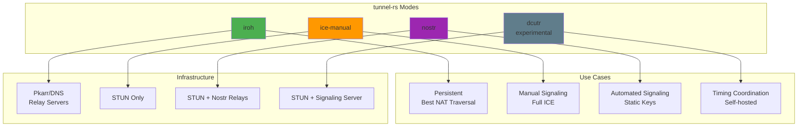
```mermaid
graph TB
    subgraph "tunnel-rs Modes"
        A[iroh]
        C[ice-manual]
        D2[nostr]
        D3[dcutr<br/>experimental]
    end

    subgraph "Use Cases"
        D[Persistent<br/>Best NAT Traversal]
        F[Manual Signaling<br/>Full ICE]
        F2[Automated Signaling<br/>Static Keys]
        F3[Timing Coordination<br/>Self-hosted]
    end

    subgraph "Infrastructure"
        G[Pkarr/DNS<br/>Relay Servers]
        I[STUN Only]
        I2[STUN + Nostr Relays]
        I3[STUN + Signaling Server]
    end

    A --> D
    C --> F
    D2 --> F2
    D3 --> F3

    A --> G
    C --> I
    D2 --> I2
    D3 --> I3

    style A fill:#4CAF50
    style C fill:#FF9800
    style D2 fill:#9C27B0
    style D3 fill:#607D8B
```

### Core Components

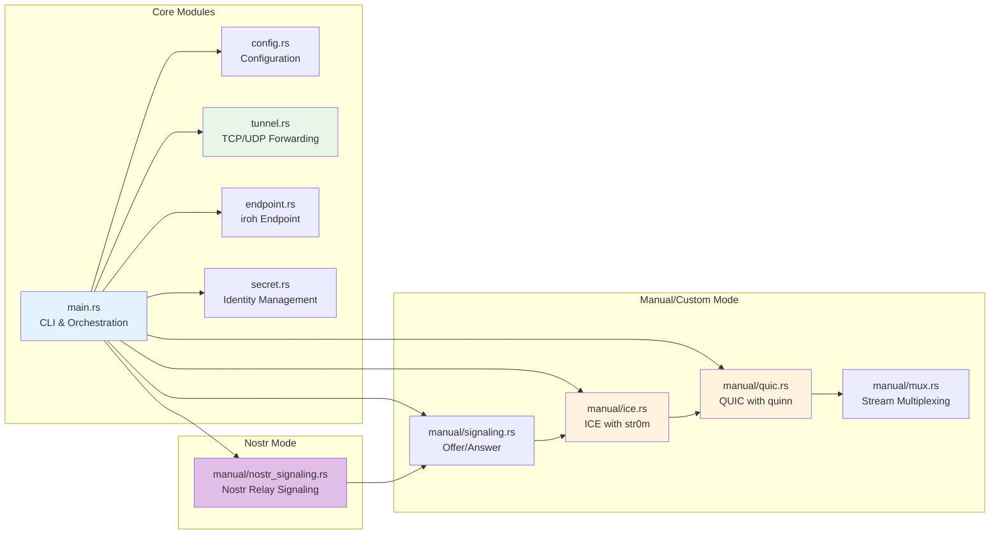
```mermaid
graph LR
    subgraph "Core Modules"
        A[main.rs<br/>CLI & Orchestration]
        B[config.rs<br/>Configuration]
        C[tunnel.rs<br/>TCP/UDP Forwarding]
        D[endpoint.rs<br/>iroh Endpoint]
        E[secret.rs<br/>Identity Management]
    end

    subgraph "Manual/Custom Mode"
        F[manual/ice.rs<br/>ICE with str0m]
        G[manual/quic.rs<br/>QUIC with quinn]
        H[manual/signaling.rs<br/>Offer/Answer]
        I[manual/mux.rs<br/>Stream Multiplexing]
    end

    subgraph "Nostr Mode"
        J[manual/nostr_signaling.rs<br/>Nostr Relay Signaling]
    end

    A --> B
    A --> C
    A --> D
    A --> E
    A --> F
    A --> G
    A --> H
    A --> J

    F --> G
    H --> F
    J --> H
    G --> I

    style A fill:#E3F2FD
    style C fill:#E8F5E9
    style F fill:#FFF3E0
    style G fill:#FFF3E0
    style J fill:#E1BEE7
```

---

## Mode Comparison

> **Tip for Containerized Environments:** Use `iroh` mode for Docker, Kubernetes, and cloud VM deployments. It includes relay fallback which ensures connectivity even when both peers are behind restrictive NATs (common in cloud environments). The `ice-nostr` and `ice-manual` modes use STUN-only NAT traversal which may fail in these environments.

### Feature Matrix

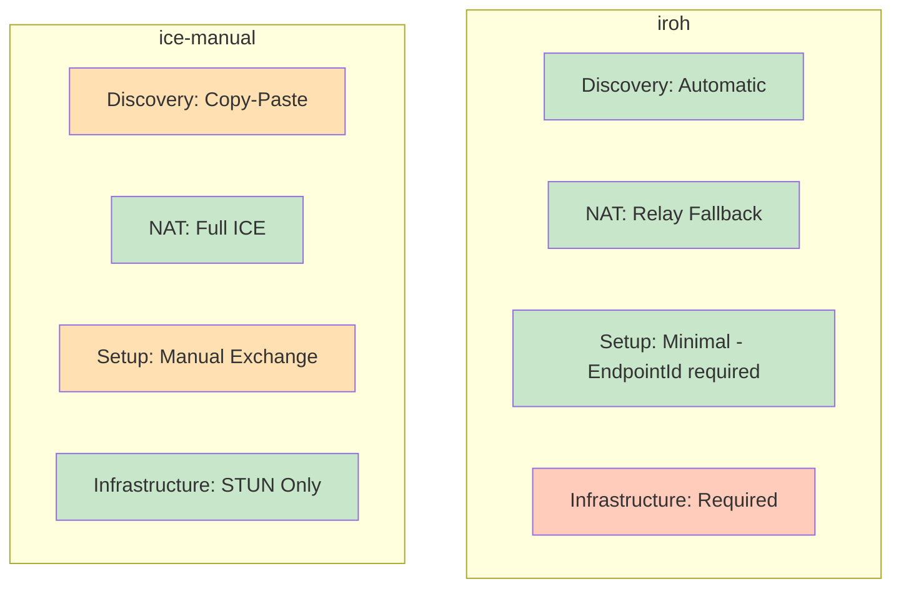
```mermaid
graph TD
    subgraph "iroh"
        A1[Discovery: Automatic]
        A2[NAT: Relay Fallback]
        A3[Setup: Minimal - EndpointId required]
        A4[Infrastructure: Required]
    end

    subgraph "ice-manual"
        C1[Discovery: Copy-Paste]
        C2[NAT: Full ICE]
        C3[Setup: Manual Exchange]
        C4[Infrastructure: STUN Only]
    end

    style A1 fill:#C8E6C9
    style A2 fill:#C8E6C9
    style A3 fill:#C8E6C9
    style A4 fill:#FFCCBC

    style C1 fill:#FFE0B2
    style C2 fill:#C8E6C9
    style C3 fill:#FFE0B2
    style C4 fill:#C8E6C9
```

### NAT Traversal Capabilities

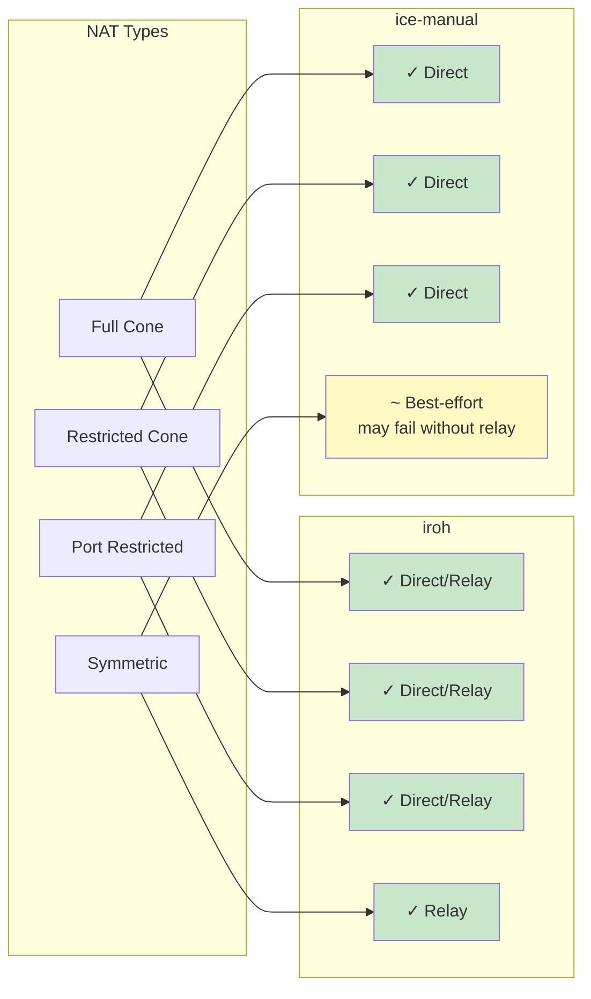
```mermaid
graph LR
    subgraph "NAT Types"
        A[Full Cone]
        B[Restricted Cone]
        C[Port Restricted]
        D[Symmetric]
    end

    subgraph "iroh"
        E1[✓ Direct/Relay]
        E2[✓ Direct/Relay]
        E3[✓ Direct/Relay]
        E4[✓ Relay]
    end

    subgraph "ice-manual"
        G1[✓ Direct]
        G2[✓ Direct]
        G3[✓ Direct]
        G4[~ Best-effort<br/>may fail without relay]
    end

    A --> E1
    B --> E2
    C --> E3
    D --> E4

    A --> G1
    B --> G2
    C --> G3
    D --> G4

    style E1 fill:#C8E6C9
    style E2 fill:#C8E6C9
    style E3 fill:#C8E6C9
    style E4 fill:#C8E6C9

    style G1 fill:#C8E6C9
    style G2 fill:#C8E6C9
    style G3 fill:#C8E6C9
    style G4 fill:#FFF9C4
```

---

## iroh Mode

### Architecture Overview

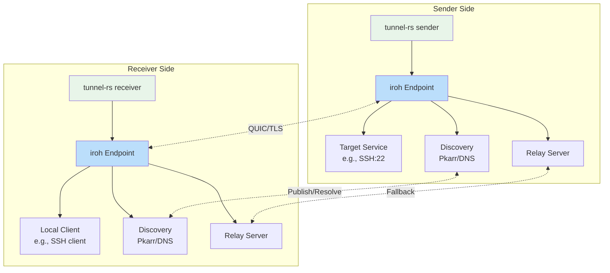
```mermaid
graph TB
    subgraph "Sender Side"
        A[tunnel-rs sender]
        B[iroh Endpoint]
        C[Target Service<br/>e.g., SSH:22]
        D[Discovery<br/>Pkarr/DNS]
        E[Relay Server]
    end
    
    subgraph "Receiver Side"
        F[tunnel-rs receiver]
        G[iroh Endpoint]
        H[Local Client<br/>e.g., SSH client]
        I[Discovery<br/>Pkarr/DNS]
        J[Relay Server]
    end
    
    A --> B
    B --> C
    B --> D
    B --> E
    
    F --> G
    G --> H
    G --> I
    G --> J
    
    B <-.QUIC/TLS.-> G
    D <-.Publish/Resolve.-> I
    E <-.Fallback.-> J
    
    style A fill:#E8F5E9
    style F fill:#E8F5E9
    style B fill:#BBDEFB
    style G fill:#BBDEFB
```

### Connection Establishment Flow

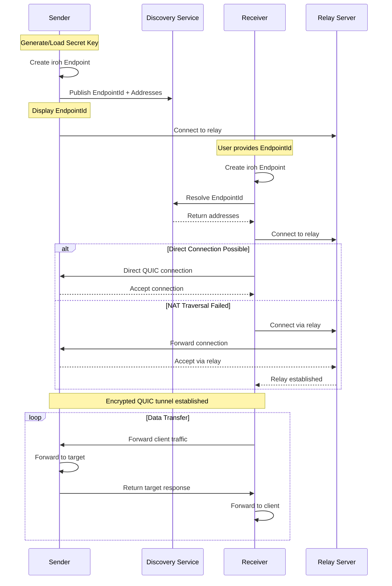
```mermaid
sequenceDiagram
    participant S as Sender
    participant SD as Discovery Service
    participant R as Receiver
    participant RS as Relay Server
    
    Note over S: Generate/Load Secret Key
    S->>S: Create iroh Endpoint
    S->>SD: Publish EndpointId + Addresses
    Note over S: Display EndpointId
    S->>RS: Connect to relay
    
    Note over R: User provides EndpointId
    R->>R: Create iroh Endpoint
    R->>SD: Resolve EndpointId
    SD-->>R: Return addresses
    R->>RS: Connect to relay
    
    alt Direct Connection Possible
        R->>S: Direct QUIC connection
        S-->>R: Accept connection
    else NAT Traversal Failed
        R->>RS: Connect via relay
        RS->>S: Forward connection
        S-->>RS: Accept via relay
        RS-->>R: Relay established
    end
    
    Note over S,R: Encrypted QUIC tunnel established
    
    loop Data Transfer
        R->>S: Forward client traffic
        S->>S: Forward to target
        S->>R: Return target response
        R->>R: Forward to client
    end
```

### TCP Tunnel Data Flow

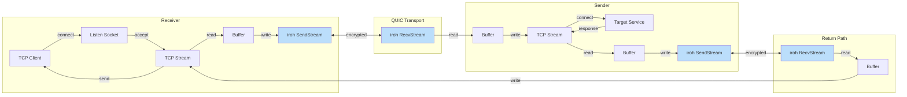
```mermaid
graph LR
    subgraph "Receiver"
        A[TCP Client] -->|connect| B[Listen Socket]
        B -->|accept| C[TCP Stream]
        C -->|read| D[Buffer]
        D -->|write| E[iroh SendStream]
    end
    
    subgraph "QUIC Transport"
        E <-->|encrypted| F[iroh RecvStream]
    end
    
    subgraph "Sender"
        F -->|read| G[Buffer]
        G -->|write| H[TCP Stream]
        H -->|connect| I[Target Service]
        I -->|response| H
        H -->|read| J[Buffer]
        J -->|write| K[iroh SendStream]
    end
    
    subgraph "Return Path"
        K <-->|encrypted| L[iroh RecvStream]
        L -->|read| M[Buffer]
        M -->|write| C
        C -->|send| A
    end
    
    style E fill:#BBDEFB
    style F fill:#BBDEFB
    style K fill:#BBDEFB
    style L fill:#BBDEFB
```

### UDP Tunnel Data Flow

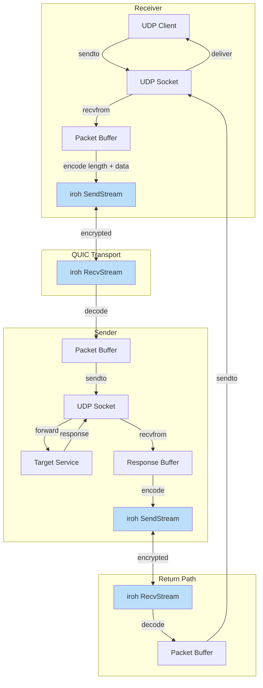
```mermaid
graph TB
    subgraph "Receiver"
        A[UDP Client] -->|sendto| B[UDP Socket]
        B -->|recvfrom| C[Packet Buffer]
        C -->|encode length + data| D[iroh SendStream]
    end
    
    subgraph "QUIC Transport"
        D <-->|encrypted| E[iroh RecvStream]
    end
    
    subgraph "Sender"
        E -->|decode| F[Packet Buffer]
        F -->|sendto| G[UDP Socket]
        G -->|forward| H[Target Service]
        H -->|response| G
        G -->|recvfrom| I[Response Buffer]
        I -->|encode| J[iroh SendStream]
    end
    
    subgraph "Return Path"
        J <-->|encrypted| K[iroh RecvStream]
        K -->|decode| L[Packet Buffer]
        L -->|sendto| B
        B -->|deliver| A
    end
    
    style D fill:#BBDEFB
    style E fill:#BBDEFB
    style J fill:#BBDEFB
    style K fill:#BBDEFB
```

### Endpoint Management

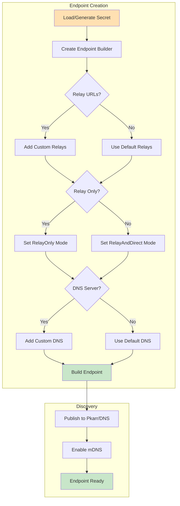
```mermaid
graph TB
    subgraph "Endpoint Creation"
        A[Load/Generate Secret] --> B[Create Endpoint Builder]
        B --> C{Relay URLs?}
        C -->|Yes| D[Add Custom Relays]
        C -->|No| E[Use Default Relays]
        D --> F{Relay Only?}
        E --> F
        F -->|Yes| G[Set RelayOnly Mode]
        F -->|No| H[Set RelayAndDirect Mode]
        G --> I{DNS Server?}
        H --> I
        I -->|Yes| J[Add Custom DNS]
        I -->|No| K[Use Default DNS]
        J --> L[Build Endpoint]
        K --> L
    end
    
    subgraph "Discovery"
        L --> M[Publish to Pkarr/DNS]
        M --> N[Enable mDNS]
        N --> O[Endpoint Ready]
    end
    
    style A fill:#FFE0B2
    style L fill:#C8E6C9
    style O fill:#C8E6C9
```

---

## ice-manual Mode

> **Note:** ice-manual mode implements full ICE with STUN-only connectivity checks. TURN/relay servers are not implemented. This means symmetric NAT peers may still fail to establish a connection without a relay fallback mechanism.

### Architecture Overview

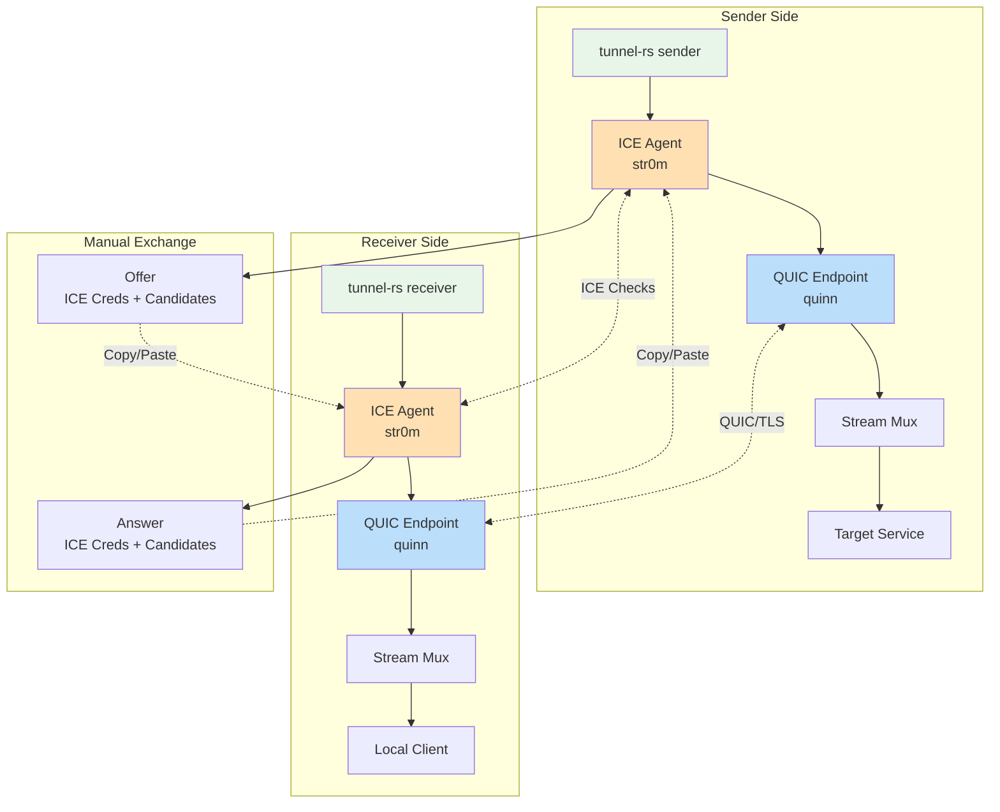
```mermaid
graph TB
    subgraph "Sender Side"
        A[tunnel-rs sender]
        B[ICE Agent<br/>str0m]
        C[QUIC Endpoint<br/>quinn]
        D[Stream Mux]
        E[Target Service]
    end
    
    subgraph "Receiver Side"
        F[tunnel-rs receiver]
        G[ICE Agent<br/>str0m]
        H[QUIC Endpoint<br/>quinn]
        I[Stream Mux]
        J[Local Client]
    end
    
    subgraph "Manual Exchange"
        K[Offer<br/>ICE Creds + Candidates]
        L[Answer<br/>ICE Creds + Candidates]
    end
    
    A --> B
    B --> C
    C --> D
    D --> E
    
    F --> G
    G --> H
    H --> I
    I --> J
    
    B --> K
    K -.Copy/Paste.-> G
    G --> L
    L -.Copy/Paste.-> B
    
    B <-.ICE Checks.-> G
    C <-.QUIC/TLS.-> H
    
    style A fill:#E8F5E9
    style F fill:#E8F5E9
    style B fill:#FFE0B2
    style G fill:#FFE0B2
    style C fill:#BBDEFB
    style H fill:#BBDEFB
```

### Full ICE + QUIC Stack

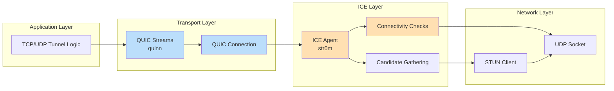
```mermaid
graph LR
    subgraph "Application Layer"
        A[TCP/UDP Tunnel Logic]
    end
    
    subgraph "Transport Layer"
        B[QUIC Streams<br/>quinn]
        C[QUIC Connection]
    end
    
    subgraph "ICE Layer"
        D[ICE Agent<br/>str0m]
        E[Connectivity Checks]
        F[Candidate Gathering]
    end
    
    subgraph "Network Layer"
        G[UDP Socket]
        H[STUN Client]
    end
    
    A --> B
    B --> C
    C --> D
    D --> E
    D --> F
    E --> G
    F --> H
    H --> G
    
    style B fill:#BBDEFB
    style C fill:#BBDEFB
    style D fill:#FFE0B2
    style E fill:#FFE0B2
```

### ICE Candidate Gathering

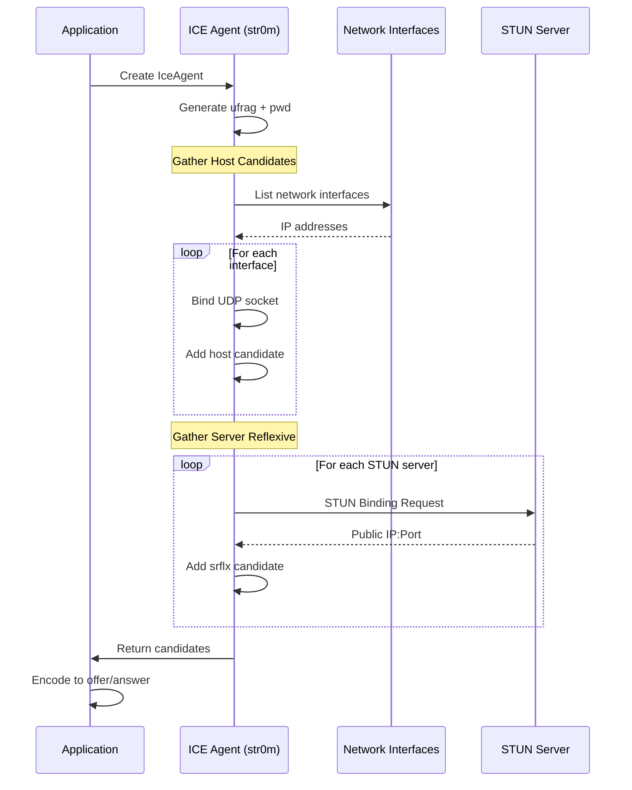
```mermaid
sequenceDiagram
    participant App as Application
    participant ICE as ICE Agent (str0m)
    participant Net as Network Interfaces
    participant STUN as STUN Server
    
    App->>ICE: Create IceAgent
    ICE->>ICE: Generate ufrag + pwd
    
    Note over ICE: Gather Host Candidates
    ICE->>Net: List network interfaces
    Net-->>ICE: IP addresses
    
    loop For each interface
        ICE->>ICE: Bind UDP socket
        ICE->>ICE: Add host candidate
    end
    
    Note over ICE: Gather Server Reflexive
    loop For each STUN server
        ICE->>STUN: STUN Binding Request
        STUN-->>ICE: Public IP:Port
        ICE->>ICE: Add srflx candidate
    end
    
    ICE->>App: Return candidates
    App->>App: Encode to offer/answer
```

### ICE Connectivity Checks

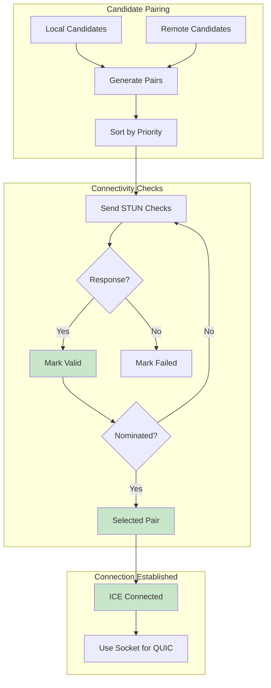
```mermaid
graph TB
    subgraph "Candidate Pairing"
        A[Local Candidates] --> C[Generate Pairs]
        B[Remote Candidates] --> C
        C --> D[Sort by Priority]
    end
    
    subgraph "Connectivity Checks"
        D --> E[Send STUN Checks]
        E --> F{Response?}
        F -->|Yes| G[Mark Valid]
        F -->|No| H[Mark Failed]
        G --> I{Nominated?}
        I -->|Yes| J[Selected Pair]
        I -->|No| E
    end
    
    subgraph "Connection Established"
        J --> K[ICE Connected]
        K --> L[Use Socket for QUIC]
    end
    
    style G fill:#C8E6C9
    style J fill:#C8E6C9
    style K fill:#C8E6C9
```

### Signaling Flow (Custom Mode)

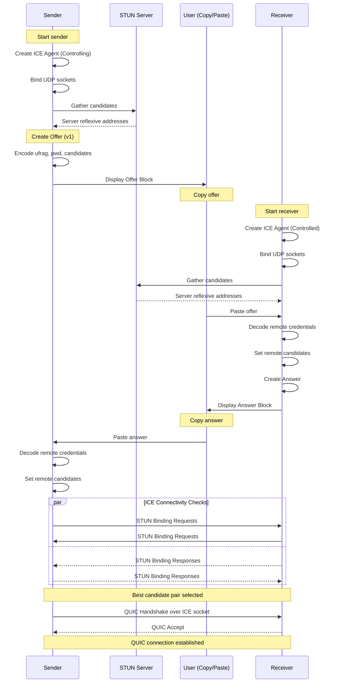
```mermaid
sequenceDiagram
    participant S as Sender
    participant STUN as STUN Server
    participant User as User (Copy/Paste)
    participant R as Receiver
    
    Note over S: Start sender
    S->>S: Create ICE Agent (Controlling)
    S->>S: Bind UDP sockets
    S->>STUN: Gather candidates
    STUN-->>S: Server reflexive addresses
    
    Note over S: Create Offer (v1)
    S->>S: Encode ufrag, pwd, candidates
    S->>User: Display Offer Block
    
    Note over User: Copy offer
    Note over R: Start receiver
    R->>R: Create ICE Agent (Controlled)
    R->>R: Bind UDP sockets
    R->>STUN: Gather candidates
    STUN-->>R: Server reflexive addresses
    
    User->>R: Paste offer
    R->>R: Decode remote credentials
    R->>R: Set remote candidates
    R->>R: Create Answer
    R->>User: Display Answer Block
    
    Note over User: Copy answer
    User->>S: Paste answer
    S->>S: Decode remote credentials
    S->>S: Set remote candidates
    
    par ICE Connectivity Checks
        S->>R: STUN Binding Requests
        R->>S: STUN Binding Requests
    and
        R-->>S: STUN Binding Responses
        S-->>R: STUN Binding Responses
    end
    
    Note over S,R: Best candidate pair selected
    
    S->>R: QUIC Handshake over ICE socket
    R-->>S: QUIC Accept
    
    Note over S,R: QUIC connection established
```

### QUIC Over ICE Socket

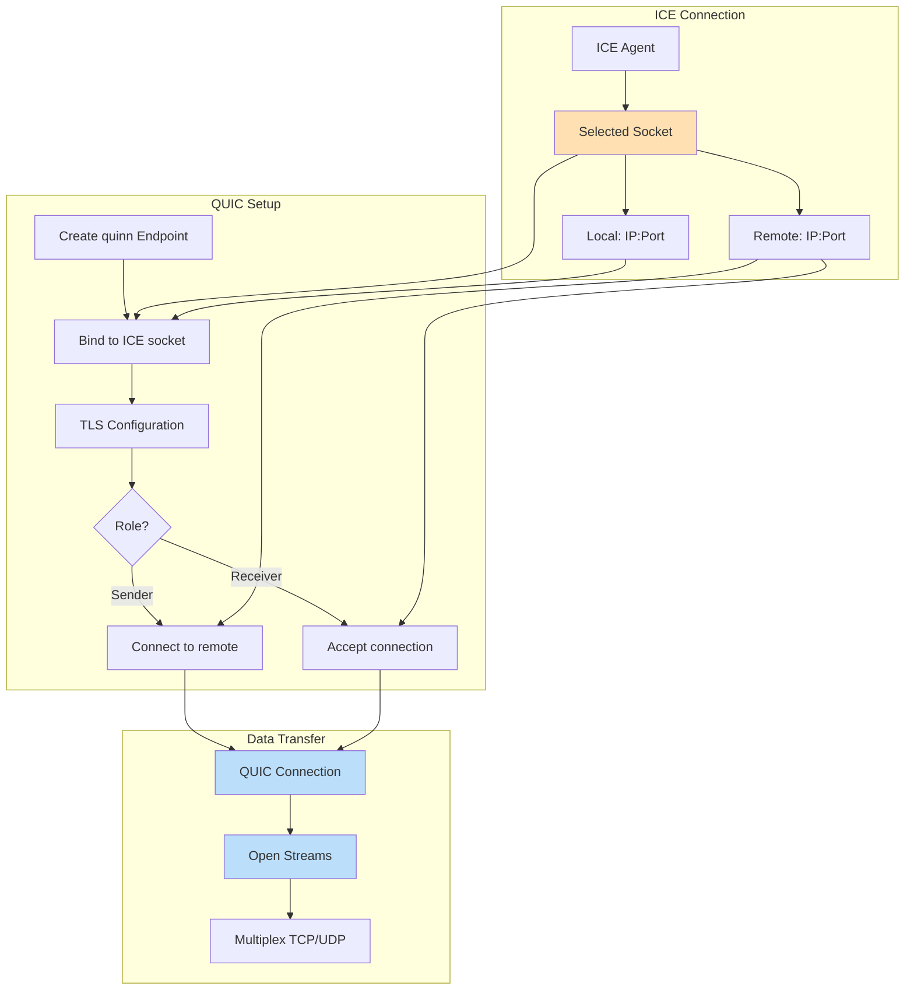
```mermaid
graph TB
    subgraph "ICE Connection"
        A[ICE Agent] --> B[Selected Socket]
        B --> C[Local: IP:Port]
        B --> D[Remote: IP:Port]
    end
    
    subgraph "QUIC Setup"
        E[Create quinn Endpoint] --> F[Bind to ICE socket]
        F --> G[TLS Configuration]
        G --> H{Role?}
        H -->|Sender| I[Connect to remote]
        H -->|Receiver| J[Accept connection]
    end
    
    subgraph "Data Transfer"
        I --> K[QUIC Connection]
        J --> K
        K --> L[Open Streams]
        L --> M[Multiplex TCP/UDP]
    end
    
    B --> F
    C --> F
    D --> I
    D --> J
    
    style B fill:#FFE0B2
    style K fill:#BBDEFB
    style L fill:#BBDEFB
```

### Stream Multiplexing

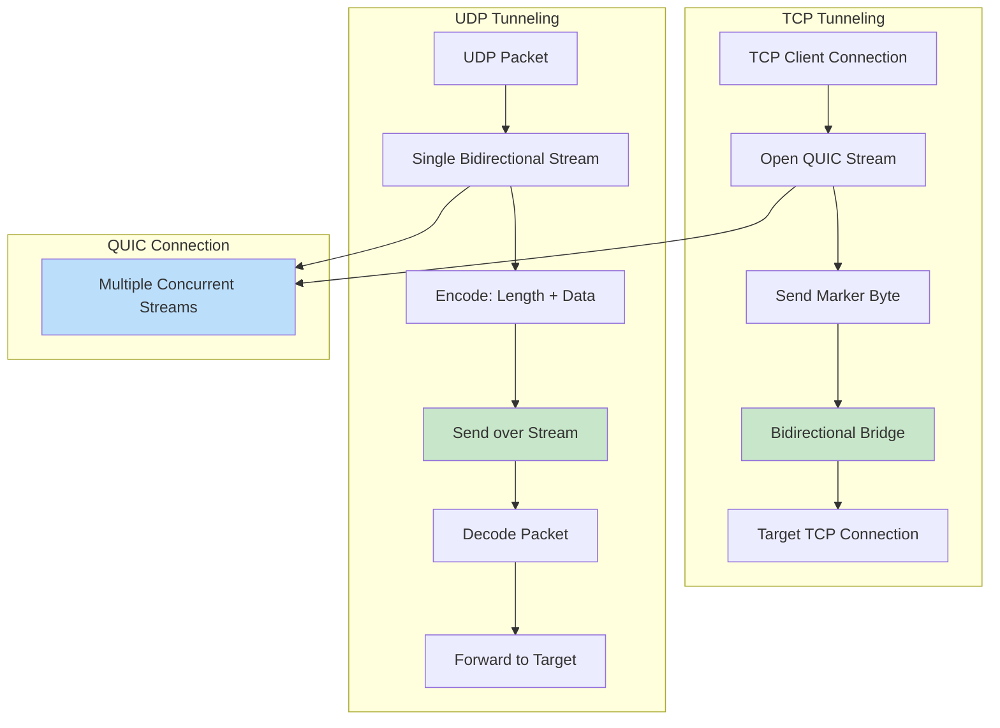
```mermaid
graph TB
    subgraph "TCP Tunneling"
        A[TCP Client Connection] --> B[Open QUIC Stream]
        B --> C[Send Marker Byte]
        C --> D[Bidirectional Bridge]
        D --> E[Target TCP Connection]
    end
    
    subgraph "UDP Tunneling"
        F[UDP Packet] --> G[Single Bidirectional Stream]
        G --> H[Encode: Length + Data]
        H --> I[Send over Stream]
        I --> J[Decode Packet]
        J --> K[Forward to Target]
    end
    
    subgraph "QUIC Connection"
        L[Multiple Concurrent Streams]
        B --> L
        G --> L
    end
    
    style L fill:#BBDEFB
    style D fill:#C8E6C9
    style I fill:#C8E6C9
```

### Connection Type Detection

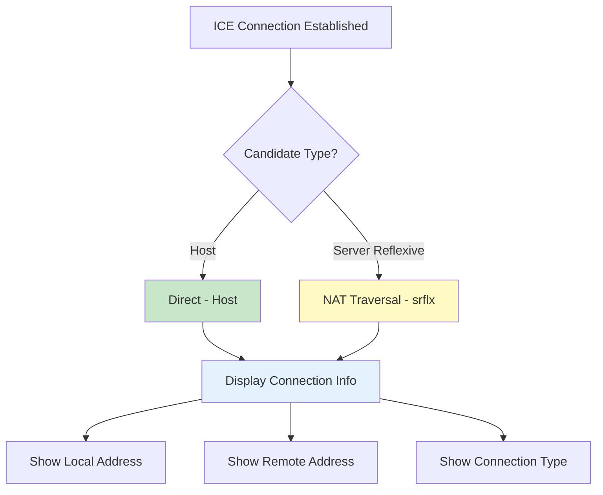
```mermaid
graph TB
    A[ICE Connection Established] --> B{Candidate Type?}
    
    B -->|Host| C[Direct - Host]
    B -->|Server Reflexive| D[NAT Traversal - srflx]
    
    C --> E[Display Connection Info]
    D --> E
    
    E --> F[Show Local Address]
    E --> G[Show Remote Address]
    E --> H[Show Connection Type]
    
    style C fill:#C8E6C9
    style D fill:#FFF9C4
    style E fill:#E3F2FD
```

---

## ice-nostr Mode

Nostr mode combines the full ICE implementation from ice-manual mode with automated signaling via Nostr relays. Instead of manual copy-paste, ICE credentials are exchanged through Nostr events using static keypairs.

> **Note for Containerized Environments:** Like ice-manual mode, nostr mode uses STUN-only NAT traversal without relay fallback. If both peers are behind restrictive NATs (common in Docker, Kubernetes, or cloud VMs), ICE connectivity may fail. For containerized deployments, consider using `iroh` mode which includes automatic relay fallback.

### Receiver-Initiated Dynamic Source

All modes use a **receiver-initiated** model for consistent UX:

- **Sender**: Whitelists allowed networks with `--allowed-tcp`/`--allowed-udp` (CIDR notation)
- **Receiver**: Specifies which service to tunnel with `--source` (hostname:port)

This is similar to SSH's `-L` flag for local port forwarding, where the client (receiver) chooses the destination.

```
Sender: --allowed-tcp 10.0.0.0/8           # Whitelist networks (no ports)
Receiver: --source tcp://postgres:5432    # Request specific service
          --target 127.0.0.1:5432         # Local listen address
```

### Architecture Overview

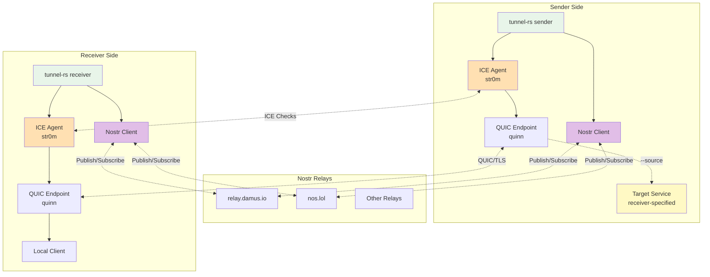
```mermaid
graph TB
    subgraph "Sender Side"
        A[tunnel-rs sender]
        B[ICE Agent<br/>str0m]
        C[QUIC Endpoint<br/>quinn]
        D[Nostr Client]
        E[Target Service<br/>receiver-specified]
    end

    subgraph "Nostr Relays"
        F[relay.damus.io]
        G[nos.lol]
        H[Other Relays]
    end

    subgraph "Receiver Side"
        I[tunnel-rs receiver]
        J[ICE Agent<br/>str0m]
        K[QUIC Endpoint<br/>quinn]
        L[Nostr Client]
        M[Local Client]
    end

    A --> B
    B --> C
    A --> D
    C -.->|--source| E

    I --> J
    J --> K
    I --> L
    K --> M

    D <-.Publish/Subscribe.-> F
    D <-.Publish/Subscribe.-> G
    L <-.Publish/Subscribe.-> F
    L <-.Publish/Subscribe.-> G

    B <-.ICE Checks.-> J
    C <-.QUIC/TLS.-> K

    style A fill:#E8F5E9
    style I fill:#E8F5E9
    style B fill:#FFE0B2
    style J fill:#FFE0B2
    style D fill:#E1BEE7
    style L fill:#E1BEE7
    style E fill:#FFF9C4
```

### Receiver-First Signaling Flow

Nostr mode uses a receiver-first protocol where the receiver initiates the signaling exchange. This allows the sender to wait for receivers to come online.

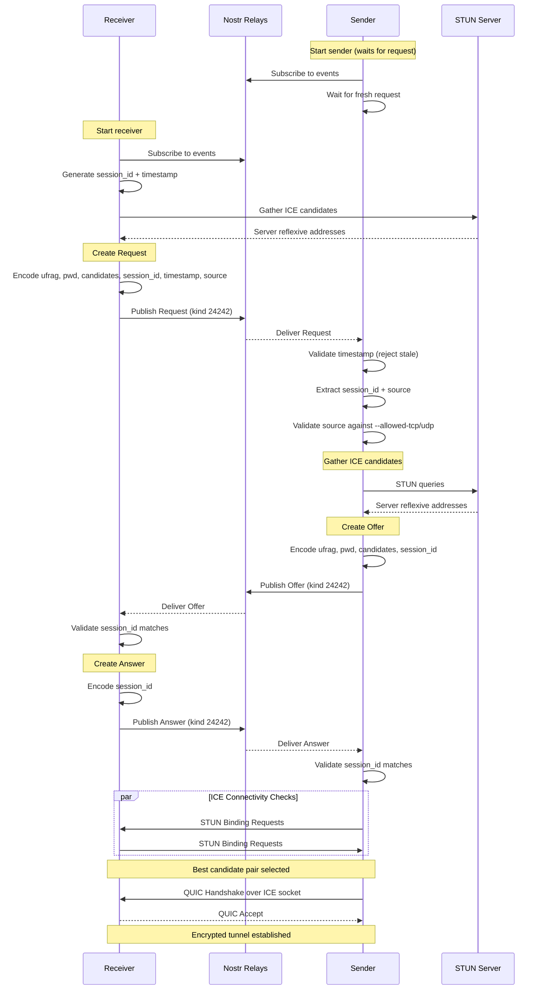
```mermaid
sequenceDiagram
    participant R as Receiver
    participant NR as Nostr Relays
    participant S as Sender
    participant STUN as STUN Server

    Note over S: Start sender (waits for request)
    S->>NR: Subscribe to events
    S->>S: Wait for fresh request

    Note over R: Start receiver
    R->>NR: Subscribe to events
    R->>R: Generate session_id + timestamp
    R->>STUN: Gather ICE candidates
    STUN-->>R: Server reflexive addresses

    Note over R: Create Request
    R->>R: Encode ufrag, pwd, candidates, session_id, timestamp, source
    R->>NR: Publish Request (kind 24242)

    NR-->>S: Deliver Request
    S->>S: Validate timestamp (reject stale)
    S->>S: Extract session_id + source
    S->>S: Validate source against --allowed-tcp/udp

    Note over S: Gather ICE candidates
    S->>STUN: STUN queries
    STUN-->>S: Server reflexive addresses

    Note over S: Create Offer
    S->>S: Encode ufrag, pwd, candidates, session_id
    S->>NR: Publish Offer (kind 24242)

    NR-->>R: Deliver Offer
    R->>R: Validate session_id matches

    Note over R: Create Answer
    R->>R: Encode session_id
    R->>NR: Publish Answer (kind 24242)

    NR-->>S: Deliver Answer
    S->>S: Validate session_id matches

    par ICE Connectivity Checks
        S->>R: STUN Binding Requests
        R->>S: STUN Binding Requests
    end

    Note over S,R: Best candidate pair selected

    S->>R: QUIC Handshake over ICE socket
    R-->>S: QUIC Accept

    Note over S,R: Encrypted tunnel established
```

### Session ID and Stale Event Filtering

Nostr events persist on relays, so tunnel-rs uses session IDs and timestamps to filter stale events from previous sessions:

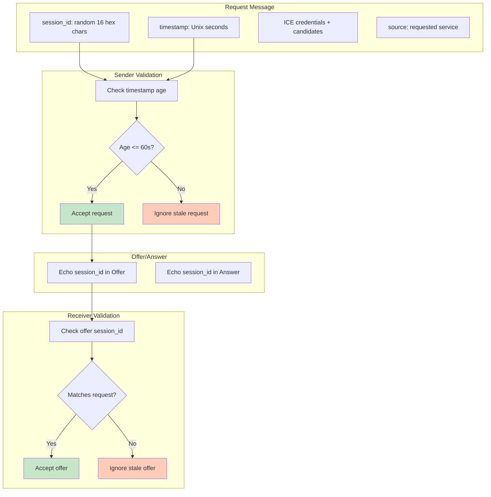
```mermaid
graph TB
    subgraph "Request Message"
        A[session_id: random 16 hex chars]
        B[timestamp: Unix seconds]
        C[ICE credentials + candidates]
        C2[source: requested service]
    end

    subgraph "Sender Validation"
        D[Check timestamp age]
        E{Age <= 60s?}
        F[Accept request]
        G[Ignore stale request]
    end

    subgraph "Offer/Answer"
        H[Echo session_id in Offer]
        I[Echo session_id in Answer]
    end

    subgraph "Receiver Validation"
        J[Check offer session_id]
        K{Matches request?}
        L[Accept offer]
        M[Ignore stale offer]
    end

    A --> D
    B --> D
    D --> E
    E -->|Yes| F
    E -->|No| G

    F --> H
    H --> J
    J --> K
    K -->|Yes| L
    K -->|No| M

    style F fill:#C8E6C9
    style L fill:#C8E6C9
    style G fill:#FFCCBC
    style M fill:#FFCCBC
```

### Nostr Event Structure

```mermaid
graph TB
    subgraph "Event Kind 24242"
        A[kind: 24242]
        B[content: base64 encoded JSON]
        C[tags]
    end

    subgraph "Tags"
        D["t" tag: transfer_id]
        E["p" tag: peer_pubkey]
        F["type" tag: message type]
    end

    subgraph "Message Types"
        G[tunnel-request]
        H[tunnel-offer]
        I[tunnel-answer]
    end

    subgraph "Transfer ID"
        J[SHA256 of sorted pubkeys]
        K[First 32 hex chars]
        L[Deterministic - both peers compute same ID]
    end

    A --> B
    A --> C
    C --> D
    C --> E
    C --> F

    F --> G
    F --> H
    F --> I

    J --> K
    K --> L
    L --> D

    style A fill:#E1BEE7
    style D fill:#FFF9C4
    style L fill:#C8E6C9
```

---

## DCUtR Mode (Experimental)

DCUtR mode provides timing-coordinated NAT hole punching using a lightweight signaling server. This mode aims to improve hole punch success rates by coordinating the exact moment both peers begin their connection attempts.

> **Experimental:** This mode is under active development. For production use, prefer `iroh` mode which has relay fallback.

### Architecture Overview

```mermaid
graph TB
    subgraph "Server Side"
        A[tunnel-rs server]
        B[ICE Agent<br/>str0m]
        C[QUIC Endpoint<br/>quinn]
        D[Target Service]
    end

    subgraph "Signaling Server"
        E[tunnel-rs-signaling]
        F[RTT Measurement]
        G[Timing Coordination]
    end

    subgraph "Client Side"
        H[tunnel-rs client]
        I[ICE Agent<br/>str0m]
        J[QUIC Endpoint<br/>quinn]
        K[Local Client]
    end

    A --> B
    B --> C
    C --> D

    H --> I
    I --> J
    J --> K

    A <-.TCP Signaling.-> E
    H <-.TCP Signaling.-> E
    E --> F
    F --> G

    B <-.ICE Checks.-> I
    C <-.QUIC/TLS.-> J

    style E fill:#607D8B
    style F fill:#607D8B
    style G fill:#607D8B
    style A fill:#E8F5E9
    style H fill:#E8F5E9
```

### Timing Coordination Flow

```mermaid
sequenceDiagram
    participant S as Server
    participant SS as Signaling Server
    participant C as Client
    participant STUN as STUN Server

    Note over S: Register with signaling server
    S->>SS: register(server_id)

    loop RTT Measurement (5 rounds)
        S->>SS: ping(seq, timestamp)
        SS-->>S: pong + store client RTT
        S->>S: Measure RTT locally
        S->>SS: Send measured RTT in next ping
    end

    Note over C: Connect and request tunnel
    C->>SS: register(client_id)

    loop RTT Measurement (5 rounds)
        C->>SS: ping(seq, timestamp)
        SS-->>C: pong + store client RTT
        C->>C: Measure RTT locally
        C->>SS: Send measured RTT in next ping
    end

    C->>SS: connect_request(peer_id, candidates)

    Note over SS: Calculate synchronized start time
    SS->>SS: start_at = now + max(RTT_S, RTT_C)/2 + buffer

    par Send sync_connect to both
        SS->>S: sync_connect(peer_candidates, start_at)
    and
        SS->>C: sync_connect(peer_candidates, start_at)
    end

    Note over S,C: Both wait until start_at, then begin ICE

    par Simultaneous ICE
        S->>STUN: Gather candidates (fast timing)
        C->>STUN: Gather candidates (fast timing)
    end

    S<-->C: ICE connectivity checks

    Note over S,C: QUIC connection over ICE socket
```

### Key Implementation Details

**True RTT Measurement:**
- Client measures round-trip time locally (response_received - request_sent)
- Client sends measured RTT to server in subsequent pings
- Avoids clock synchronization issues between peers

**Fast ICE Timing:**
- Uses aggressive timing parameters for coordinated attempts
- 20ms timing advance (vs 50ms standard)
- 100ms initial STUN RTO (vs 250ms standard)
- 1000ms max STUN RTO (vs 3000ms standard)

**500ms Timing Buffer:**
- Added to coordinated start time to account for clock skew, jitter, and processing

---

## Configuration System

### Configuration File Structure

```mermaid
graph TB
    subgraph "Config File"
        A[role: sender/receiver]
        B[mode: iroh/ice-manual/nostr]
        C[source/target: tcp://host:port or udp://host:port]
    end

    subgraph "Mode Sections"
        E[iroh]
        G[ice-manual]
        H[nostr]
    end

    subgraph "iroh Options"
        I[secret_file]
        J[relay_urls]
        K[relay_only]
        L[dns_server]
        M[node_id - receiver only]
    end

    subgraph "ice-manual Options"
        N[stun_servers]
    end

    subgraph "nostr Options"
        O[nsec/nsec_file]
        P[peer_npub]
        Q[relays]
        R[stun_servers]
    end

    A --> S[Validation]
    B --> S
    S --> E
    S --> G
    S --> H

    E --> I
    E --> J
    E --> K
    E --> L
    E --> M

    G --> N
    H --> O
    H --> P
    H --> Q
    H --> R

    style S fill:#FFF9C4
```

### Configuration Loading Flow

```mermaid
sequenceDiagram
    participant CLI as CLI Parser
    participant Main as Main
    participant Config as Config Module
    participant File as Config File
    
    CLI->>Main: Parse arguments
    Main->>Main: Check config flags
    
    alt --default-config
        Main->>Config: Load from default path
        Config->>File: Read ~/.config/tunnel-rs/{role}.toml
    else -c <path>
        Main->>Config: Load from path
        Config->>File: Read specified file
    else No config flag
        Main->>Main: Use CLI arguments only
    end
    
    alt Config loaded
        File-->>Config: TOML content
        Config->>Config: Parse TOML
        Config->>Config: Validate role + mode
        Config-->>Main: Validated config
        Main->>Main: Merge with CLI args
    end
    
    Main->>Main: Proceed with merged config
```

### Config Validation

```mermaid
graph TB
    A[Load Config] --> B{Role matches?}
    B -->|No| C[Error: Role mismatch]
    B -->|Yes| D{Mode matches?}
    D -->|No| E[Error: Mode mismatch]
    D -->|Yes| F{Check sections}
    
    F --> G{Extra sections?}
    G -->|Yes| H[Error: Unexpected section]
    G -->|No| I{Required fields?}
    
    I -->|Missing| J[Error: Missing field]
    I -->|Present| K[Validation Success]
    
    style C fill:#FFCCBC
    style E fill:#FFCCBC
    style H fill:#FFCCBC
    style J fill:#FFCCBC
    style K fill:#C8E6C9
```

---

## Security Model

### Encryption Stack

```mermaid
graph TB
    subgraph "Application Data"
        A[TCP/UDP Payload]
    end
    
    subgraph "QUIC Layer"
        B[QUIC Stream Encryption]
        C[TLS 1.3]
        D[Per-Stream Keys]
    end
    
    subgraph "Transport"
        E[QUIC Packets]
        F[Authenticated Encryption]
    end
    
    subgraph "Network"
        G[UDP Datagrams]
    end
    
    A --> B
    B --> C
    C --> D
    D --> E
    E --> F
    F --> G
    
    style C fill:#C8E6C9
    style D fill:#C8E6C9
    style F fill:#C8E6C9
```

### Identity and Authentication

```mermaid
graph TB
    subgraph "iroh Mode"
        A[Secret Key File] --> B[Ed25519 Private Key]
        B --> C[EndpointId - Public Key]
        C --> D[Peer Authentication]
    end

    subgraph "Custom Mode"
        H[ICE Credentials] --> I[ufrag + pwd]
        I --> J[STUN Auth]
        J --> K[QUIC TLS]
    end

    style B fill:#FFE0B2
    style C fill:#C8E6C9
    style K fill:#C8E6C9
```

### Threat Model

```mermaid
graph TB
    subgraph "Protected Against"
        A[Eavesdropping<br/>TLS 1.3 encryption]
        B[MITM<br/>Peer authentication]
        C[Replay Attacks<br/>QUIC nonces]
        D[Tampering<br/>Authenticated encryption]
    end
    
    subgraph "User Responsibility"
        E[Signaling Channel Security<br/>Manual modes]
        F[Secret Key Protection<br/>iroh]
        G[EndpointId Verification<br/>Trust on first use]
    end
    
    style A fill:#C8E6C9
    style B fill:#C8E6C9
    style C fill:#C8E6C9
    style D fill:#C8E6C9
    
    style E fill:#FFF9C4
    style F fill:#FFF9C4
    style G fill:#FFF9C4
```

### Secret Key Management

```mermaid
sequenceDiagram
    participant User as User
    participant CLI as CLI
    participant Secret as Secret Module
    participant FS as File System
    
    alt Generate New Secret
        User->>CLI: generate-iroh-key --output key.file
        CLI->>Secret: Generate Ed25519 key
        Secret->>Secret: Derive EndpointId
        Secret->>FS: Write with 0600 permissions
        FS-->>Secret: Success
        Secret->>CLI: Display EndpointId
        CLI->>User: Show EndpointId
    end
    
    alt Load Existing Secret
        User->>CLI: sender --secret-file key.file
        CLI->>FS: Read key file
        FS-->>Secret: Key bytes
        Secret->>Secret: Parse Ed25519 key
        Secret->>Secret: Derive EndpointId
        Secret-->>CLI: Secret + EndpointId
    end
    
    alt Show EndpointId
        User->>CLI: show-iroh-node-id --secret-file key.file
        CLI->>FS: Read key file
        FS-->>Secret: Key bytes
        Secret->>Secret: Derive EndpointId
        Secret->>User: Display EndpointId
    end
```

---

## Protocol Support

### TCP Tunneling Architecture

```mermaid
graph TB
    subgraph "Receiver Side"
        A[Listen Socket] --> B[Accept Connection]
        B --> C[TCP Stream]
        C --> D[Async Read/Write]
    end
    
    subgraph "QUIC Tunnel"
        E[Open Bi-Stream]
        F[Send Stream]
        G[Recv Stream]
    end
    
    subgraph "Sender Side"
        H[Connect to Target]
        I[TCP Stream]
        J[Async Read/Write]
    end
    
    D --> E
    E --> F
    E --> G
    
    F --> J
    G --> D
    J --> H
    
    style E fill:#BBDEFB
    style F fill:#BBDEFB
    style G fill:#BBDEFB
```

### UDP Tunneling Architecture

```mermaid
graph TB
    subgraph "Receiver Side"
        A[UDP Socket] --> B[Receive Packet]
        B --> C[Track Client Address]
        C --> D[Encode: u16 len + data]
    end
    
    subgraph "QUIC Tunnel"
        E[Single Bidirectional Stream]
        F[Send Stream]
        G[Recv Stream]
    end
    
    subgraph "Sender Side"
        H[Decode Packet]
        I[Send to Target]
        J[Receive Response]
        K[Encode Response]
    end
    
    subgraph "Return Path"
        L[Send via QUIC]
        M[Decode at Receiver]
        N[Send to Client]
    end
    
    D --> E
    E --> F
    F --> H
    H --> I
    I --> J
    J --> K
    K --> L
    L --> G
    G --> M
    M --> N
    N --> C
    
    style E fill:#BBDEFB
    style F fill:#BBDEFB
    style G fill:#BBDEFB
    style L fill:#BBDEFB
```

### UDP Packet Framing

```mermaid
graph LR
    subgraph "UDP Packet"
        A[Payload<br/>variable length]
    end
    
    subgraph "QUIC Stream Frame"
        B[Length<br/>u16 BE]
        C[Payload<br/>bytes]
    end
    
    subgraph "Decoding"
        D[Read 2 bytes]
        E[Parse length]
        F[Read N bytes]
        G[Reconstruct packet]
    end
    
    A --> B
    A --> C
    
    B --> D
    D --> E
    E --> F
    C --> F
    F --> G
    
    style B fill:#FFF9C4
    style C fill:#C8E6C9
```

---

## Component Details

### IceAgent (str0m)

The `IceAgent` from str0m handles ICE connectivity establishment:

- **Candidate Gathering**: Discovers local and server-reflexive addresses
- **Connectivity Checks**: Performs STUN binding checks to all candidate pairs
- **Nomination**: Selects the best working candidate pair
- **Socket Management**: Provides the UDP socket for QUIC transport

### QUIC Endpoint (quinn)

The `quinn` QUIC implementation provides:

- **TLS 1.3**: Encrypted transport with certificate-based auth
- **Stream Multiplexing**: Multiple concurrent streams over one connection
- **Congestion Control**: Built-in congestion control and flow control
- **0-RTT**: Not currently enabled (future optimization)

### Endpoint (iroh)

The `iroh::Endpoint` provides:

- **Discovery**: Automatic peer discovery via Pkarr/DNS/mDNS
- **Relay**: Fallback relay servers for NAT traversal
- **QUIC**: Built-in QUIC transport with hole punching
- **Identity**: Ed25519-based peer identity and authentication

---

## Performance Considerations

### Connection Establishment Times

```mermaid
graph LR
    subgraph "iroh"
        A[Discovery: 1-3s]
        B[Connection: 0.5-2s]
        C[Total: 1.5-5s]
    end

    subgraph "ice-manual"
        H[ICE Gather: 1-2s]
        I[Manual: User dependent]
        J[ICE Checks: 1-3s]
        K[QUIC: 0.5s]
        L[Total: 2.5-5.5s + manual]
    end

    style C fill:#FFF9C4
    style L fill:#FFF9C4
```

### Throughput Characteristics

- **TCP Tunneling**: Limited by QUIC stream flow control and congestion control
- **UDP Tunneling**: Additional framing overhead (2 bytes per packet)
- **Relay Mode**: Higher latency, potentially lower throughput
- **Direct Mode**: Near-native performance with encryption overhead

---

## Error Handling

### Connection Failures

```mermaid
graph TB
    A[Connection Attempt] --> B{Success?}
    B -->|Yes| C[Established]
    B -->|No| D{Mode?}
    
    D -->|iroh| E{Relay available?}
    E -->|Yes| F[Fallback to relay]
    E -->|No| G[Connection failed]

    D -->|ice-manual| I[ICE checks failed]
    
    F --> C
    H --> G
    I --> G
    
    style C fill:#C8E6C9
    style F fill:#FFF9C4
    style G fill:#FFCCBC
```

### Stream Errors

- **TCP**: Connection reset, timeout → close QUIC stream
- **UDP**: Packet loss → no retry (UDP semantics preserved)
- **QUIC**: Stream reset → close local TCP connection or stop UDP forwarding

---

## Mode Capabilities

| Mode | Multi-Session | Dynamic Source | Description |
|------|---------------|----------------|-------------|
| `iroh` | **Yes** | **Yes** | Multiple receivers, receiver specifies `--source` |
| `ice-nostr` | **Yes** | **Yes** | Multiple receivers, receiver specifies `--source` |
| `ice-manual` | No | **Yes** | Single session, receiver specifies `--source` |
| `dcutr` | No | **Yes** | Single session, timing-coordinated (experimental) |

**Multi-Session** = Multiple concurrent connections to the same sender
**Dynamic Source** = Receiver specifies which service to tunnel (via `--source`)

---

## Current Limitations

### Single Session (Manual Signaling Mode)

The `ice-manual` mode currently supports only one tunnel session at a time per sender instance. Each signaling exchange establishes exactly one tunnel.

```mermaid
graph TB
    subgraph "ice-manual Behavior"
        A[Sender starts] --> B[Wait for receiver offer]
        B --> C[Validate source request]
        C --> D[Establish single tunnel]
        D --> E[Handle streams over this tunnel]
        E --> F[Additional receivers timeout]
    end

    subgraph "Workarounds"
        G[Run multiple sender instances]
        I[Use iroh mode]
    end

    style F fill:#FFCCBC
    style I fill:#C8E6C9
```

**Why this limitation exists:**
- Manual signaling mode performs a single offer/answer exchange
- The sender enters a connection handling loop after establishing the tunnel
- No mechanism to accept additional signaling while serving existing tunnel

**Workarounds:**
- Use `iroh` mode for multi-receiver support
- Run separate sender instances for each tunnel

See [Roadmap](ROADMAP.md) for planned multi-session support.

---

## References

- [iroh Documentation](https://iroh.computer/)
- [str0m ICE Implementation](https://github.com/algesten/str0m)
- [quinn QUIC Implementation](https://github.com/quinn-rs/quinn)
- [RFC 8445 - ICE](https://datatracker.ietf.org/doc/html/rfc8445)
- [RFC 9000 - QUIC](https://datatracker.ietf.org/doc/html/rfc9000)
