# tunnel-rs Architecture

This document provides a comprehensive overview of the tunnel-rs architecture, including detailed diagrams of all four operational modes, component interactions, data flows, and security considerations.

## Table of Contents

- [System Overview](#system-overview)
- [Mode Comparison](#mode-comparison)
- [iroh Mode](#iroh-mode)
- [VPN Mode](#vpn-mode)
- [manual Mode](#manual-mode)
- [nostr Mode](#nostr-mode)
- [Configuration System](#configuration-system)
- [Security Model](#security-model)
- [Protocol Support](#protocol-support)
- [Mode Capabilities](#mode-capabilities)
- [Current Limitations](#current-limitations)

---

## System Overview

tunnel-rs is a P2P TCP/UDP port forwarding tool that supports multiple distinct operational modes, each optimized for different use cases and network environments.

Binary layout:
- `tunnel-rs`: iroh mode (port forwarding)
- `tunnel-rs-vpn`: VPN mode (Linux/macOS)
- `tunnel-rs-ice`: manual and nostr modes

> **Design Goal:** The project's primary goal is to provide a convenient way to connect to different networks for development or homelab purposes without the hassle and security risk of opening a port. It is **not** meant for production setups or designed to be performant at scale.

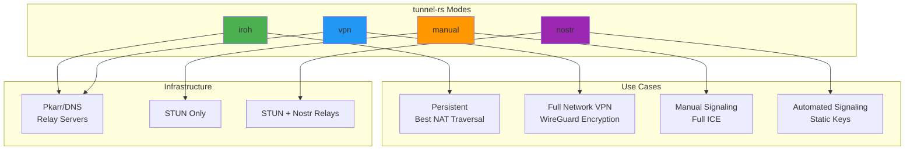

### Binaries & Crates

The project is split into separate binaries to isolate dependencies:

| Binary | Modes | Key Modules |
|--------|-------|-------------|
| `tunnel-rs` | `iroh` | `iroh_mode`, `auth`, `socks5_bridge` |
| `tunnel-rs-vpn` | `vpn` | `tunnel_vpn`, `auth` |
| `tunnel-rs-ice` | `manual`, `nostr` | `custom`, `nostr`, `transport` |

The `test-utils` feature is still available on the iroh crates/binary to enable `--relay-only` for testing.

### Core Components

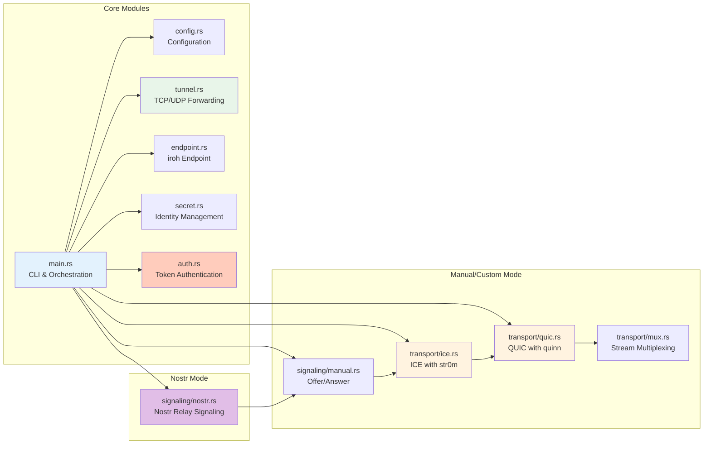

---

## Mode Comparison

> **Tip for Containerized Environments:** Use `iroh` mode for Docker, Kubernetes, and cloud VM deployments. It includes relay fallback which ensures connectivity even when both peers are behind restrictive NATs (common in cloud environments). The `nostr` and `manual` modes use STUN-only NAT traversal which may fail in these environments.

### Feature Matrix

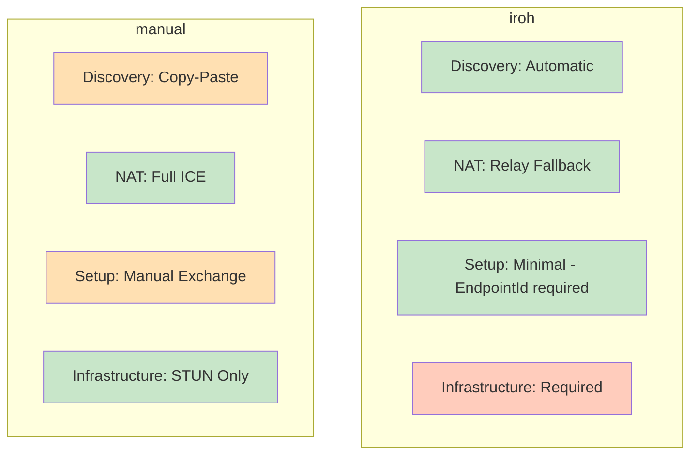

### NAT Traversal Capabilities

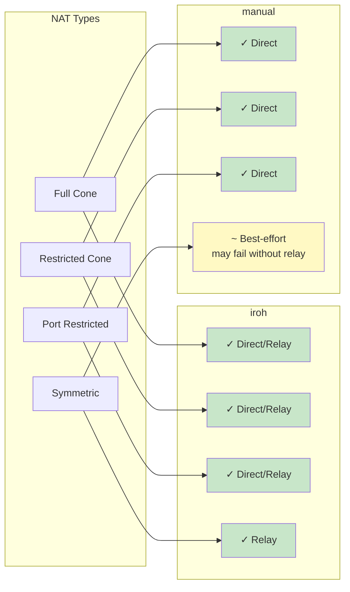

---

## iroh Mode

### Architecture Overview

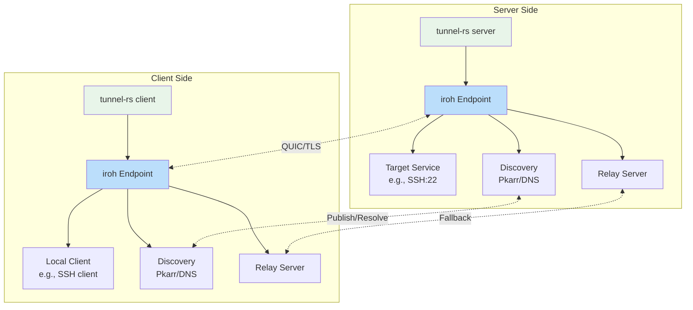

### Connection Establishment Flow

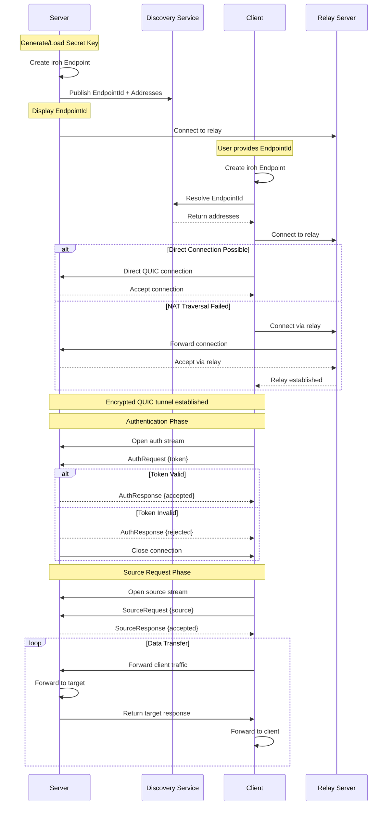

### TCP Tunnel Data Flow

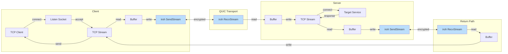

### UDP Tunnel Data Flow


### Endpoint Management

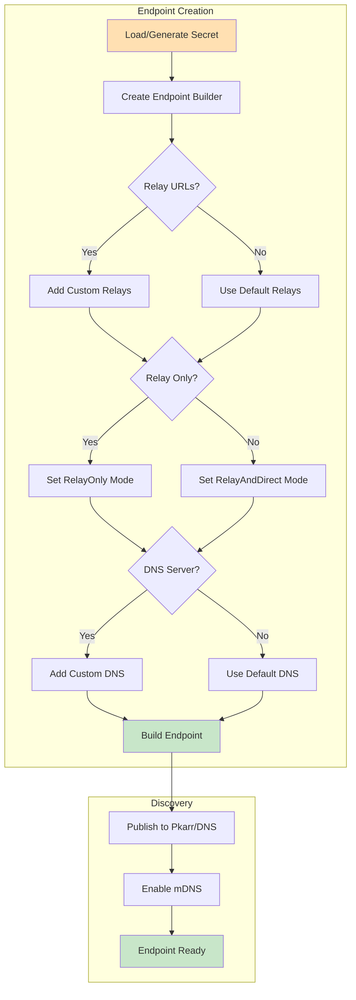

---

## VPN Mode

VPN mode provides full network tunneling using WireGuard encryption via the boringtun library. Unlike port forwarding modes, VPN mode creates a TUN device and routes IP traffic.

> **Note:** VPN mode is only available on Linux and macOS. It requires root/sudo privileges.

### Architecture Overview

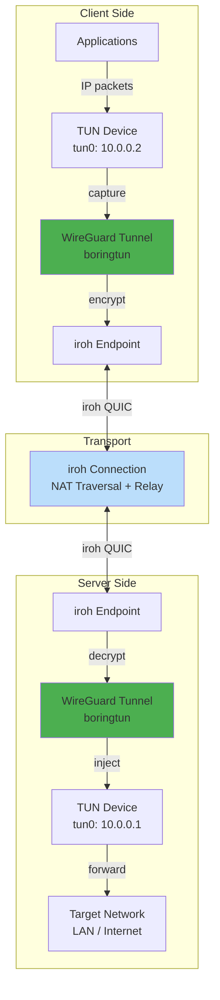

### Key Components

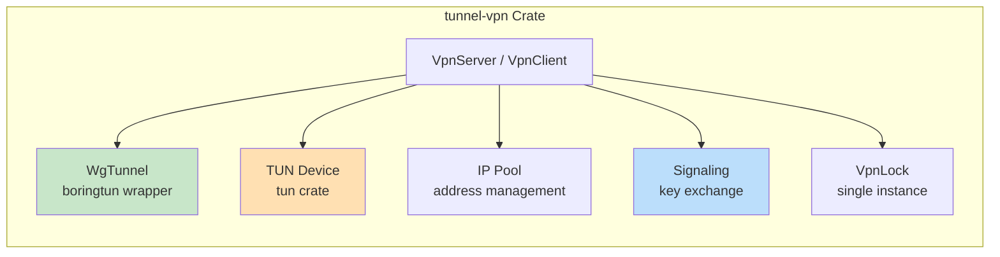

### Connection Flow

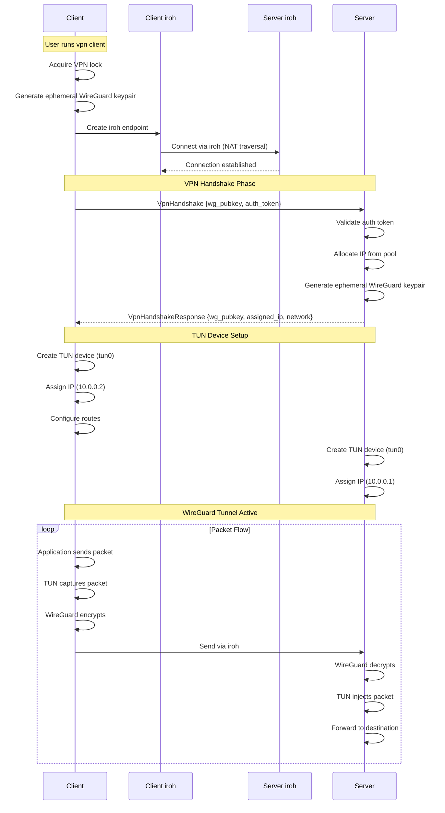

### WireGuard Integration

The VPN mode uses **boringtun** (Cloudflare's userspace WireGuard) for encryption:

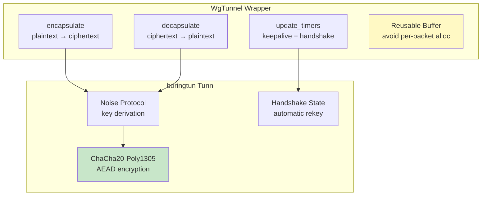

**Key Design Decisions:**
- **Ephemeral keys**: WireGuard keypairs are generated per-session (no static config)
- **Reusable buffers**: Avoid heap allocation per packet for performance
- **Atomic connection counting**: Server tracks active clients with `AtomicUsize`
- **Single instance lock**: File-based lock prevents multiple VPN clients

### IP Pool Management

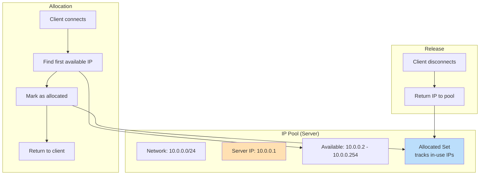

### Platform-Specific Details

| Platform | TUN Device | Route Configuration | Privileges |
|----------|------------|---------------------|------------|
| Linux | `/dev/net/tun` | `ip route add` | CAP_NET_ADMIN or root |
| macOS | `utunX` | `route add` | root |

### Security Model

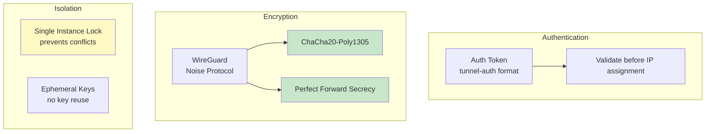

### Auto-Reconnect and Connection Health

VPN mode includes automatic reconnection when the WireGuard tunnel fails. This handles scenarios like server restarts, network changes, or WireGuard session expiration.

**Configuration:**
- `auto_reconnect = true` (default): Automatically reconnect on connection loss
- `auto_reconnect = false`: Exit on first disconnection
- `max_reconnect_attempts`: Limit total attempts (unlimited if not set)

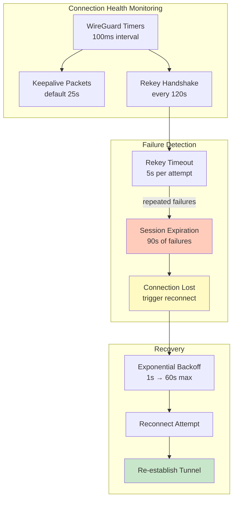

**WireGuard Session Expiration:**

The boringtun library manages WireGuard handshake state. When rekey fails:
1. `REKEY_TIMEOUT` warning logged every 5 seconds
2. After 90 seconds of failures, `ConnectionExpired` error returned
3. Timer task detects error and exits VPN loop
4. `run_with_reconnect` handles reconnection with backoff

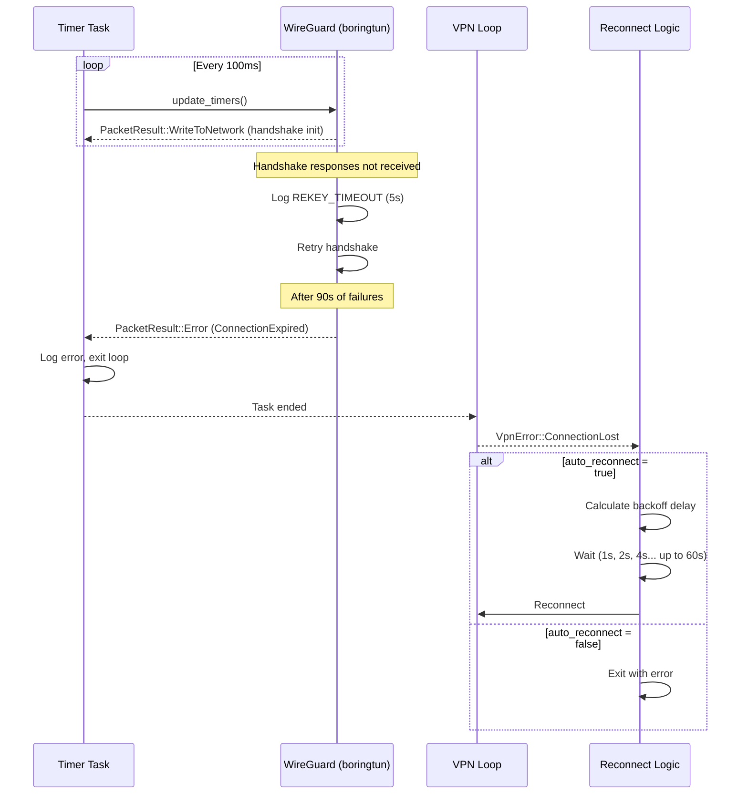

**Reconnection Backoff:**
- Base delay: 1 second
- Exponential growth: 1s → 2s → 4s → 8s → 16s → 32s → 60s
- Maximum delay: 60 seconds
- Jitter: 0-500ms added to prevent thundering herd
- Counter reset: Resets to 0 after successful tunnel operation

---

## manual Mode

> **Note:** manual mode implements full ICE with STUN-only connectivity checks. TURN/relay servers are not implemented. This means symmetric NAT peers may still fail to establish a connection without a relay fallback mechanism.

### Architecture Overview

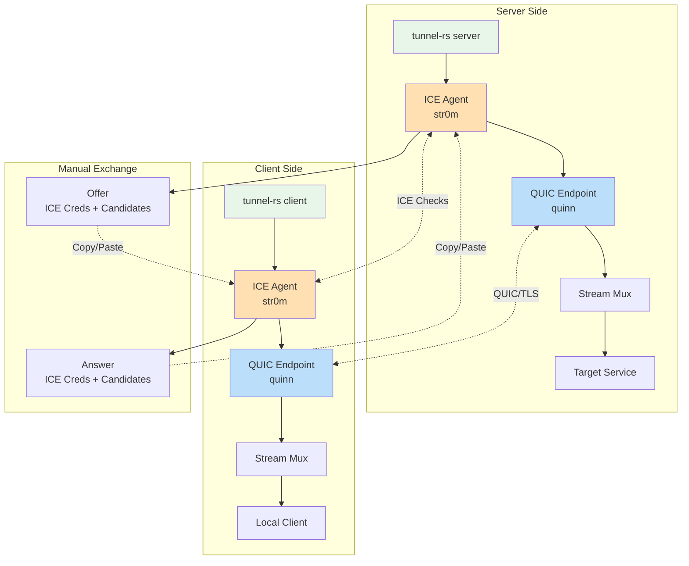

### Full ICE + QUIC Stack

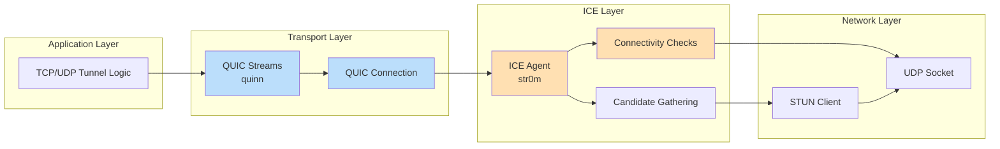

### ICE Candidate Gathering

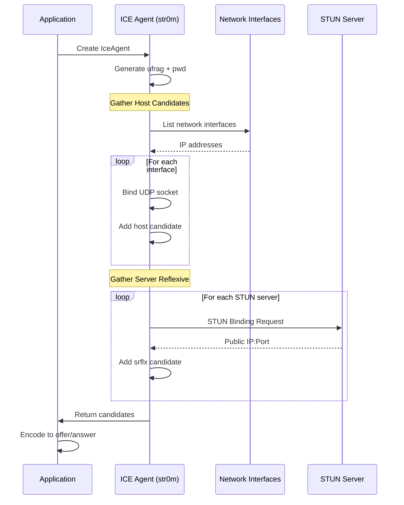

### ICE Connectivity Checks

```mermaid
graph TB
    subgraph "Candidate Pairing"
        A[Local Candidates] --> C[Generate Pairs]
        B[Remote Candidates] --> C
        C --> D[Sort by Priority]
    end
    
    subgraph "Connectivity Checks"
        D --> E[Send STUN Checks]
        E --> F{Response?}
        F -->|Yes| G[Mark Valid]
        F -->|No| H[Mark Failed]
        G --> I{Nominated?}
        I -->|Yes| J[Selected Pair]
        I -->|No| E
    end
    
    subgraph "Connection Established"
        J --> K[ICE Connected]
        K --> L[Use Socket for QUIC]
    end
    
    style G fill:#C8E6C9
    style J fill:#C8E6C9
    style K fill:#C8E6C9
```

### Signaling Flow (Custom Mode)

```mermaid
sequenceDiagram
    participant C as Client
    participant STUN as STUN Server
    participant User as User (Copy/Paste)
    participant S as Server

    Note over C: Start client
    C->>C: Create ICE Agent (Controlling)
    C->>C: Bind UDP sockets
    C->>STUN: Gather candidates
    STUN-->>C: Server reflexive addresses

    Note over C: Create Offer (v1)
    C->>C: Encode ufrag, pwd, candidates, source
    C->>User: Display Offer Block

    Note over User: Copy offer
    Note over S: Start server
    S->>S: Create ICE Agent (Controlled)
    S->>S: Bind UDP sockets
    S->>STUN: Gather candidates
    STUN-->>S: Server reflexive addresses

    User->>S: Paste offer
    S->>S: Decode remote credentials + source
    S->>S: Validate source against --allowed-tcp/udp
    S->>S: Create Answer
    S->>User: Display Answer Block

    Note over User: Copy answer
    User->>C: Paste answer
    C->>C: Decode remote credentials
    C->>C: Set remote candidates

    par ICE Connectivity Checks
        S->>C: STUN Binding Requests
        C->>S: STUN Binding Requests
    and
        C-->>S: STUN Binding Responses
        S-->>C: STUN Binding Responses
    end

    Note over S,C: Best candidate pair selected

    S->>C: QUIC Handshake over ICE socket
    C-->>S: QUIC Accept

    Note over S,C: QUIC connection established
```

### QUIC Over ICE Socket

```mermaid
graph TB
    subgraph "ICE Connection"
        A[ICE Agent] --> B[Selected Socket]
        B --> C[Local: IP:Port]
        B --> D[Remote: IP:Port]
    end
    
    subgraph "QUIC Setup"
        E[Create quinn Endpoint] --> F[Bind to ICE socket]
        F --> G[TLS Configuration]
        G --> H{Role?}
        H -->|Server| I[Connect to remote]
        H -->|Client| J[Accept connection]
    end
    
    subgraph "Data Transfer"
        I --> K[QUIC Connection]
        J --> K
        K --> L[Open Streams]
        L --> M[Multiplex TCP/UDP]
    end
    
    B --> F
    C --> F
    D --> I
    D --> J
    
    style B fill:#FFE0B2
    style K fill:#BBDEFB
    style L fill:#BBDEFB
```

### Stream Multiplexing

```mermaid
graph TB
    subgraph "TCP Tunneling"
        A[TCP Client Connection] --> B[Open QUIC Stream]
        B --> C[Send Marker Byte]
        C --> D[Bidirectional Bridge]
        D --> E[Target TCP Connection]
    end
    
    subgraph "UDP Tunneling"
        F[UDP Packet] --> G[Single Bidirectional Stream]
        G --> H[Encode: Length + Data]
        H --> I[Send over Stream]
        I --> J[Decode Packet]
        J --> K[Forward to Target]
    end
    
    subgraph "QUIC Connection"
        L[Multiple Concurrent Streams]
        B --> L
        G --> L
    end
    
    style L fill:#BBDEFB
    style D fill:#C8E6C9
    style I fill:#C8E6C9
```

### Connection Type Detection

```mermaid
graph TB
    A[ICE Connection Established] --> B{Candidate Type?}
    
    B -->|Host| C[Direct - Host]
    B -->|Server Reflexive| D[NAT Traversal - srflx]
    
    C --> E[Display Connection Info]
    D --> E
    
    E --> F[Show Local Address]
    E --> G[Show Remote Address]
    E --> H[Show Connection Type]
    
    style C fill:#C8E6C9
    style D fill:#FFF9C4
    style E fill:#E3F2FD
```

---

## nostr Mode

Nostr mode combines the full ICE implementation from manual mode with automated signaling via Nostr relays. Instead of manual copy-paste, ICE credentials are exchanged through Nostr events using static keypairs.

> **Note for Containerized Environments:** Like manual mode, nostr mode uses STUN-only NAT traversal without relay fallback. If both peers are behind restrictive NATs (common in Docker, Kubernetes, or cloud VMs), ICE connectivity may fail. For containerized deployments, consider using `iroh` mode which includes automatic relay fallback.

### Client-Initiated Dynamic Source

All modes use a **client-initiated** model for consistent UX:

- **Server**: Whitelists allowed networks with `--allowed-tcp`/`--allowed-udp` (CIDR notation)
- **Client**: Specifies which service to tunnel with `--source` (hostname:port)

This is similar to SSH's `-L` flag for local port forwarding, where the client chooses the destination.

```
Server: --allowed-tcp 10.0.0.0/8           # Whitelist networks (no ports)
Client: --source tcp://postgres:5432       # Request specific service
        --target 127.0.0.1:5432            # Local listen address
```

### Architecture Overview

```mermaid
graph TB
    subgraph "Server Side"
        A[tunnel-rs server]
        B[ICE Agent<br/>str0m]
        C[QUIC Endpoint<br/>quinn]
        D[Nostr Client]
        E[Target Service<br/>client-specified]
    end

    subgraph "Nostr Relays"
        F[relay.nostr.net]
        G[nos.lol]
        H[relay.primal.net / relay.snort.social]
    end

    subgraph "Client Side"
        I[tunnel-rs client]
        J[ICE Agent<br/>str0m]
        K[QUIC Endpoint<br/>quinn]
        L[Nostr Client]
        M[Local Client]
    end

    A --> B
    B --> C
    A --> D
    C -.->|--source| E

    I --> J
    J --> K
    I --> L
    K --> M

    D <-.Publish/Subscribe.-> F
    D <-.Publish/Subscribe.-> G
    L <-.Publish/Subscribe.-> F
    L <-.Publish/Subscribe.-> G

    B <-.ICE Checks.-> J
    C <-.QUIC/TLS.-> K

    style A fill:#E8F5E9
    style I fill:#E8F5E9
    style B fill:#FFE0B2
    style J fill:#FFE0B2
    style D fill:#E1BEE7
    style L fill:#E1BEE7
    style E fill:#FFF9C4
```

### Client-First Signaling Flow

Nostr mode uses a client-first protocol where the client initiates the signaling exchange. This allows the server to wait for clients to come online.

```mermaid
sequenceDiagram
    participant C as Client
    participant NR as Nostr Relays
    participant S as Server
    participant STUN as STUN Server

    Note over S: Start server (waits for request)
    S->>NR: Subscribe to events
    S->>S: Wait for fresh request

    Note over C: Start client
    C->>NR: Subscribe to events
    C->>C: Generate session_id + timestamp
    C->>STUN: Gather ICE candidates
    STUN-->>C: Server reflexive addresses

    Note over C: Create Request
    C->>C: Encode ufrag, pwd, candidates, session_id, timestamp, source
    C->>NR: Publish Request (kind 24242)

    NR-->>S: Deliver Request
    S->>S: Validate timestamp (reject stale)
    S->>S: Extract session_id + source
    S->>S: Validate source against --allowed-tcp/udp

    Note over S: Gather ICE candidates
    S->>STUN: STUN queries
    STUN-->>S: Server reflexive addresses

    Note over S: Create Offer
    S->>S: Encode ufrag, pwd, candidates, session_id
    S->>NR: Publish Offer (kind 24242)

    NR-->>C: Deliver Offer
    C->>C: Validate session_id matches

    Note over C: Create Answer
    C->>C: Encode session_id
    C->>NR: Publish Answer (kind 24242)

    NR-->>S: Deliver Answer
    S->>S: Validate session_id matches

    par ICE Connectivity Checks
        S->>C: STUN Binding Requests
        C->>S: STUN Binding Requests
    end

    Note over S,C: Best candidate pair selected

    S->>C: QUIC Handshake over ICE socket
    C-->>S: QUIC Accept

    Note over S,C: Encrypted tunnel established
```

### Session ID and Stale Event Filtering

Nostr events persist on relays, so tunnel-rs uses session IDs and timestamps to filter stale events from previous sessions:

```mermaid
graph TB
    subgraph "Request Message"
        A[session_id: random 16 hex chars]
        B[timestamp: Unix seconds]
        C[ICE credentials + candidates]
        C2[source: requested service]
    end

    subgraph "Server Validation"
        D[Check timestamp age]
        E{Age <= 30s?}
        F[Accept request]
        G[Ignore stale request]
    end

    subgraph "Offer/Answer"
        H[Echo session_id in Offer]
        I[Echo session_id in Answer]
    end

    subgraph "Client Validation"
        J[Check offer session_id]
        K{Matches request?}
        L[Accept offer]
        M[Ignore stale offer]
    end

    A --> D
    B --> D
    D --> E
    E -->|Yes| F
    E -->|No| G

    F --> H
    H --> J
    J --> K
    K -->|Yes| L
    K -->|No| M

    style F fill:#C8E6C9
    style L fill:#C8E6C9
    style G fill:#FFCCBC
    style M fill:#FFCCBC
```

### Nostr Event Structure

```mermaid
graph TB
    subgraph "Event Kind 24242"
        A[kind: 24242]
        B[content: base64 encoded JSON]
        C[tags]
    end

    subgraph "Tags"
        D["t" tag: transfer_id]
        E["p" tag: peer_pubkey]
        F["type" tag: message type]
    end

    subgraph "Message Types"
        G[tunnel-request]
        H[tunnel-offer]
        I[tunnel-answer]
    end

    subgraph "Transfer ID"
        J[SHA256 of sorted pubkeys]
        K[First 32 hex chars]
        L[Deterministic - both peers compute same ID]
    end

    A --> B
    A --> C
    C --> D
    C --> E
    C --> F

    F --> G
    F --> H
    F --> I

    J --> K
    K --> L
    L --> D

    style A fill:#E1BEE7
    style D fill:#FFF9C4
    style L fill:#C8E6C9
```

---

## Configuration System

### Configuration File Structure

```mermaid
graph TB
    subgraph "Config File"
        A[role: server/client]
        B[mode: iroh/manual/nostr]
        C[source/target: tcp://host:port or udp://host:port]
    end

    subgraph "Mode Sections"
        E[iroh]
        G[manual]
        H[nostr]
    end

    subgraph "iroh Options"
        I[secret_file]
        I2[auth_tokens - server only]
        I3[auth_token - client only]
        J[relay_urls]
        K[relay_only]
        L[dns_server]
        M[server_node_id - client only]
    end

    subgraph "manual Options"
        N[stun_servers]
    end

    subgraph "nostr Options"
        O[nsec/nsec_file]
        P[peer_npub]
        Q[relays]
        R[stun_servers]
    end

    A --> S[Validation]
    B --> S
    S --> E
    S --> G
    S --> H

    E --> I
    E --> I2
    E --> I3
    E --> J
    E --> K
    E --> L
    E --> M

    G --> N
    H --> O
    H --> P
    H --> Q
    H --> R

    style S fill:#FFF9C4
```

### Configuration Loading Flow

```mermaid
sequenceDiagram
    participant CLI as CLI Parser
    participant Main as Main
    participant Config as Config Module
    participant File as Config File
    
    CLI->>Main: Parse arguments
    Main->>Main: Check config flags
    
    alt --default-config
        Main->>Config: Load from default path
        Config->>File: Read ~/.config/tunnel-rs/{role}.toml (tunnel-rs) or ~/.config/tunnel-rs/{role}_ice.toml (tunnel-rs-ice)
    else -c <path>
        Main->>Config: Load from path
        Config->>File: Read specified file
    else No config flag
        Main->>Main: Use CLI arguments only
    end
    
    alt Config loaded
        File-->>Config: TOML content
        Config->>Config: Parse TOML
        Config->>Config: Validate role + mode
        Config-->>Main: Validated config
        Main->>Main: Merge with CLI args
    end
    
    Main->>Main: Proceed with merged config
```

Note: For `tunnel-rs-ice`, the mode is inferred from the config file, so `server -c <file>` / `client -c <file>` can be used without a subcommand.

### Config Validation

```mermaid
graph TB
    A[Load Config] --> B{Role matches?}
    B -->|No| C[Error: Role mismatch]
    B -->|Yes| D{Mode matches?}
    D -->|No| E[Error: Mode mismatch]
    D -->|Yes| F{Check sections}
    
    F --> G{Extra sections?}
    G -->|Yes| H[Ignored by parser]
    G -->|No| I{Required fields?}
    
    I -->|Missing| J[Error: Missing field]
    I -->|Present| K[Validation Success]
    
    style C fill:#FFCCBC
    style E fill:#FFCCBC
    style H fill:#FFF9C4
    style J fill:#FFCCBC
    style K fill:#C8E6C9
```

---

## Security Model

### Encryption Stack

```mermaid
graph TB
    subgraph "Application Data"
        A[TCP/UDP Payload]
    end
    
    subgraph "QUIC Layer"
        B[QUIC Stream Encryption]
        C[TLS 1.3]
        D[Per-Stream Keys]
    end
    
    subgraph "Transport"
        E[QUIC Packets]
        F[Authenticated Encryption]
    end
    
    subgraph "Network"
        G[UDP Datagrams]
    end
    
    A --> B
    B --> C
    C --> D
    D --> E
    E --> F
    F --> G
    
    style C fill:#C8E6C9
    style D fill:#C8E6C9
    style F fill:#C8E6C9
```

### Identity and Authentication

```mermaid
graph TB
    subgraph "iroh Mode"
        A[Server Secret Key] --> B[Ed25519 Private Key]
        B --> C[EndpointId - Public Key]
        C --> D[Client Connects]
        D --> E[Token Validation]
        E --> F{Valid Token?}
        F -->|Yes| G[Authenticated]
        F -->|No| H[Rejected]
    end

    subgraph "manual Mode"
        I[ICE Credentials] --> J[ufrag + pwd]
        J --> K[STUN Auth]
        K --> L[QUIC TLS]
    end

    style B fill:#FFE0B2
    style C fill:#C8E6C9
    style G fill:#C8E6C9
    style H fill:#FFCCBC
    style L fill:#C8E6C9
```

### Token Authentication (iroh Mode)

Iroh mode requires authentication using pre-shared tokens. Clients use ephemeral identities but must provide a valid token. **Authentication is mandatory and must complete successfully before any source requests are permitted.** The client must authenticate via a dedicated auth stream with a valid token within a 10-second timeout immediately after QUIC connection establishment.

1. **Server Configuration**: Server specifies `--auth-tokens` with one or more pre-shared tokens
2. **Client Configuration**: Client specifies `--auth-token` with the token received from the server admin
3. **Protocol Flow**: Client opens a dedicated auth stream immediately after connection and sends an `AuthRequest`. **No source requests are accepted until authentication succeeds.**
4. **Validation**: Server validates the token using `is_token_valid()` within a 10-second timeout
5. **Rejection**: Invalid tokens receive an `AuthResponse::rejected()` and the connection is closed immediately

This early validation prevents unauthorized clients from holding open connections or attempting source requests.

```mermaid
sequenceDiagram
    participant C as Client
    participant S as Server
    participant A as Auth Module

    C->>S: Connect (QUIC TLS handshake)
    S->>C: Accept connection

    Note over C,S: Auth Phase (10s timeout)
    C->>S: Open auth stream
    C->>S: AuthRequest {version, auth_token}
    S->>A: is_token_valid(auth_token, auth_tokens)
    alt Token is valid
        A-->>S: true
        S->>C: AuthResponse {accepted: true}
        Note over S,C: Connection authenticated
    else Token is invalid
        A-->>S: false
        S->>C: AuthResponse {accepted: false, reason}
        S->>S: Close connection (error code 1)
        Note over S,C: Connection rejected
    else Timeout (no auth within 10s)
        S->>S: Close connection (error code 2)
        Note over S,C: Connection rejected
    end

    Note over C,S: Source Request Phase (after successful auth)
    C->>S: Open source stream
    C->>S: SourceRequest {source}
    S->>S: Validate source against allowed networks
    S->>C: SourceResponse::accepted()
    Note over S,C: Proceed with tunnel data transfer
```

### Threat Model

```mermaid
graph TB
    subgraph "Protected Against"
        A[Eavesdropping<br/>TLS 1.3 encryption]
        B[MITM<br/>Peer authentication]
        C[Replay Attacks<br/>QUIC nonces]
        D[Tampering<br/>Authenticated encryption]
        E2[Unauthorized Access<br/>Token Authentication - iroh mode]
    end

    subgraph "User Responsibility"
        E[Signaling Channel Security<br/>Manual modes]
        F[Secret Key Protection<br/>iroh server]
        G[EndpointId Verification<br/>Trust on first use]
        H[Auth Token Security<br/>Treat tokens like passwords]
    end

    style A fill:#C8E6C9
    style B fill:#C8E6C9
    style C fill:#C8E6C9
    style D fill:#C8E6C9
    style E2 fill:#C8E6C9

    style E fill:#FFF9C4
    style F fill:#FFF9C4
    style G fill:#FFF9C4
    style H fill:#FFF9C4
```

### Secret Key Management (Server Only)

In iroh mode, only the **server** needs a persistent secret key to maintain a stable EndpointId. Clients use ephemeral identities and authenticate via tokens.

```mermaid
sequenceDiagram
    participant User as User
    participant CLI as CLI
    participant Secret as Secret Module
    participant FS as File System

    alt Generate Server Key
        User->>CLI: generate-server-key --output server.key
        CLI->>Secret: Generate Ed25519 key
        Secret->>Secret: Derive EndpointId
        Secret->>FS: Write with 0600 permissions
        FS-->>Secret: Success
        Secret->>CLI: Display EndpointId
        CLI->>User: Show EndpointId (share with clients)
    end

    alt Load Server Secret
        User->>CLI: server --secret-file server.key
        CLI->>FS: Read key file
        FS-->>Secret: Key bytes
        Secret->>Secret: Parse Ed25519 key
        Secret->>Secret: Derive EndpointId
        Secret-->>CLI: Secret + EndpointId
    end

    alt Show EndpointId
        User->>CLI: show-server-id --secret-file server.key
        CLI->>FS: Read key file
        FS-->>Secret: Key bytes
        Secret->>Secret: Derive EndpointId
        Secret->>User: Display EndpointId
    end
```

---

## Protocol Support

### TCP Tunneling Architecture

```mermaid
graph TB
    subgraph "Client Side"
        A[Listen Socket] --> B[Accept Connection]
        B --> C[TCP Stream]
        C --> D[Async Read/Write]
    end

    subgraph "QUIC Tunnel"
        E[Open Bi-Stream]
        F[Send Stream]
        G[Recv Stream]
    end

    subgraph "Server Side"
        H[Connect to Target]
        I[TCP Stream]
        J[Async Read/Write]
    end
    
    D --> E
    E --> F
    E --> G
    
    F --> J
    G --> D
    J --> H
    
    style E fill:#BBDEFB
    style F fill:#BBDEFB
    style G fill:#BBDEFB
```

### UDP Tunneling Architecture

```mermaid
graph TB
    subgraph "Client Side"
        A[UDP Socket] --> B[Receive Packet]
        B --> C[Track Client Address]
        C --> D[Encode: u16 len + data]
    end

    subgraph "QUIC Tunnel"
        E[Single Bidirectional Stream]
        F[Send Stream]
        G[Recv Stream]
    end

    subgraph "Server Side"
        H[Decode Packet]
        I[Send to Target]
        J[Receive Response]
        K[Encode Response]
    end
    
    subgraph "Return Path"
        L[Send via QUIC]
        M[Decode at Client]
        N[Send to Client]
    end
    
    D --> E
    E --> F
    F --> H
    H --> I
    I --> J
    J --> K
    K --> L
    L --> G
    G --> M
    M --> N
    N --> C
    
    style E fill:#BBDEFB
    style F fill:#BBDEFB
    style G fill:#BBDEFB
    style L fill:#BBDEFB
```

### UDP Packet Framing

```mermaid
graph LR
    subgraph "UDP Packet"
        A[Payload<br/>variable length]
    end
    
    subgraph "QUIC Stream Frame"
        B[Length<br/>u16 BE]
        C[Payload<br/>bytes]
    end
    
    subgraph "Decoding"
        D[Read 2 bytes]
        E[Parse length]
        F[Read N bytes]
        G[Reconstruct packet]
    end
    
    A --> B
    A --> C
    
    B --> D
    D --> E
    E --> F
    C --> F
    F --> G
    
    style B fill:#FFF9C4
    style C fill:#C8E6C9
```

---

## Component Details

### IceAgent (str0m)

The `IceAgent` from str0m handles ICE connectivity establishment:

- **Candidate Gathering**: Discovers local and server-reflexive addresses
- **Connectivity Checks**: Performs STUN binding checks to all candidate pairs
- **Nomination**: Selects the best working candidate pair
- **Socket Management**: Provides the UDP socket for QUIC transport

### QUIC Endpoint (quinn)

The `quinn` QUIC implementation provides:

- **TLS 1.3**: Encrypted transport with certificate-based auth
- **Stream Multiplexing**: Multiple concurrent streams over one connection
- **Congestion Control**: Built-in congestion control and flow control
- **0-RTT**: Not currently enabled (future optimization)

### Endpoint (iroh)

The `iroh::Endpoint` provides:

- **Discovery**: Automatic peer discovery via Pkarr/DNS/mDNS
- **Relay**: Fallback relay servers for NAT traversal
- **QUIC**: Built-in QUIC transport with hole punching
- **Identity**: Ed25519-based peer identity and authentication

### SOCKS5 Bridge (Tor Support)

For `.onion` relay URLs, tunnel-rs creates local TCP bridges through a Tor SOCKS5 proxy:

- **Tor-Only**: SOCKS5 proxy requires all relay URLs to be `.onion` addresses
- **Proxy Validation**: At startup, validates the proxy is a real Tor proxy via `check.torproject.org`
- **Relay Bridge**: Routes relay connections through SOCKS5 proxy to `.onion` addresses
- **Transparent**: URLs are rewritten to localhost, iroh connects normally
- **No DNS Server**: When using SOCKS5 proxy, DNS server is not used (relay handles discovery)
- **Direct P2P Bypass**: Direct P2P connections bypass Tor entirely (no performance impact)

---

## Performance Considerations

### Connection Establishment Times

```mermaid
graph LR
    subgraph "iroh"
        A[Discovery: 1-3s]
        B[Connection: 0.5-2s]
        C[Total: 1.5-5s]
    end

    subgraph "manual"
        H[ICE Gather: 1-2s]
        I[Manual: User dependent]
        J[ICE Checks: 1-3s]
        K[QUIC: 0.5s]
        L[Total: 2.5-5.5s + manual]
    end

    style C fill:#FFF9C4
    style L fill:#FFF9C4
```

### Throughput Characteristics

- **TCP Tunneling**: Limited by QUIC stream flow control and congestion control
- **UDP Tunneling**: Additional framing overhead (2 bytes per packet)
- **Relay Mode**: Higher latency, potentially lower throughput
- **Direct Mode**: Near-native performance with encryption overhead

---

## Error Handling

### Connection Failures

```mermaid
graph TB
    A[Connection Attempt] --> B{Success?}
    B -->|Yes| C[Established]
    B -->|No| D{Mode?}
    
    D -->|iroh| E{Relay available?}
    E -->|Yes| F[Fallback to relay]
    E -->|No| G[Connection failed]

    D -->|manual| I[ICE checks failed]
    
    F --> C
    H --> G
    I --> G
    
    style C fill:#C8E6C9
    style F fill:#FFF9C4
    style G fill:#FFCCBC
```

### Stream Errors

- **TCP**: Connection reset, timeout → close QUIC stream
- **UDP**: Packet loss → no retry (UDP semantics preserved)
- **QUIC**: Stream reset → close local TCP connection or stop UDP forwarding

---

## Mode Capabilities

| Mode | Multi-Session | Dynamic Source | Encryption | Platform |
|------|---------------|----------------|------------|----------|
| `iroh` | **Yes** | **Yes** | QUIC/TLS 1.3 | Linux, macOS, Windows |
| `vpn` | **Yes** | N/A (full tunnel) | WireGuard + QUIC | Linux, macOS |
| `nostr` | **Yes** | **Yes** | QUIC/TLS 1.3 | Linux, macOS, Windows |
| `manual` | No | **Yes** | QUIC/TLS 1.3 | Linux, macOS, Windows |

**Multi-Session** = Multiple concurrent connections to the same server
**Dynamic Source** = Client specifies which service to tunnel (via `--source`)
**VPN Mode** = Full network tunneling with automatic IP assignment (no per-port config)

---

## Current Limitations

### Single Session (Manual Signaling Mode)

The `manual` mode currently supports only one tunnel session at a time per server instance. Each signaling exchange establishes exactly one tunnel.

```mermaid
graph TB
    subgraph "manual Behavior"
        A[Server starts] --> B[Wait for client offer]
        B --> C[Validate source request]
        C --> D[Establish single tunnel]
        D --> E[Handle streams over this tunnel]
        E --> F[Additional clients timeout]
    end

    subgraph "Workarounds"
        G[Run multiple server instances]
        I[Use iroh mode]
    end

    style F fill:#FFCCBC
    style I fill:#C8E6C9
```

**Why this limitation exists:**
- Manual signaling mode performs a single offer/answer exchange
- The server enters a connection handling loop after establishing the tunnel
- No mechanism to accept additional signaling while serving existing tunnel

**Workarounds:**
- Use `iroh` mode for multi-client support
- Run separate server instances for each tunnel

See [Roadmap](ROADMAP.md) for planned multi-session support.

---

## References

- [iroh Documentation](https://iroh.computer/)
- [str0m ICE Implementation](https://github.com/algesten/str0m)
- [quinn QUIC Implementation](https://github.com/quinn-rs/quinn)
- [RFC 8445 - ICE](https://datatracker.ietf.org/doc/html/rfc8445)
- [RFC 9000 - QUIC](https://datatracker.ietf.org/doc/html/rfc9000)
