# tunnel-rs Architecture

This document provides a comprehensive overview of the tunnel-rs architecture, including detailed diagrams of all four operational modes, component interactions, data flows, and security considerations.

## Table of Contents

- [System Overview](#system-overview)
- [Mode Comparison](#mode-comparison)
- [Mode-Specific Architecture](#mode-specific-architecture)
- [Configuration System](#configuration-system)
- [Security Model](#security-model)
- [Protocol Support](#protocol-support)
- [Component Details](#component-details)
- [Performance Considerations](#performance-considerations)
- [Error Handling](#error-handling)
- [Mode Capabilities](#mode-capabilities)
- [Current Limitations](#current-limitations)
- [References](#references)

---

## System Overview

tunnel-rs is a P2P TCP/UDP port forwarding tool that supports multiple distinct operational modes, each optimized for different use cases and network environments.

Binary layout:
- `tunnel-rs`: iroh mode (port forwarding)
- `tunnel-rs-vpn`: VPN mode (iroh)
- `tunnel-rs-ice`: manual and nostr modes (port forwarding)

> **Design Goal:** The project's primary goal is to provide a convenient way to connect to different networks for development or homelab purposes without the hassle and security risk of opening a port. It is **not** meant for production setups or designed to be performant at scale.

### Binaries & Crates

The project is split into separate binaries to isolate dependencies:

| Binary | Modes | Key Modules |
|--------|-------|-------------|
| `tunnel-rs` | `iroh` | `iroh_mode`, `auth` |
| `tunnel-rs-vpn` | `vpn` (iroh) | `tunnel_vpn`, `auth` |
| `tunnel-rs-ice` | `manual`, `nostr` | `custom`, `nostr`, `transport` |

Relay-only is a CLI-only flag that forces connections through relay servers instead of attempting direct connections. It is intended for testing or special scenarios and is not supported in config files to avoid accidental activation. See `tunnel-rs --help` for usage.

### Core Components

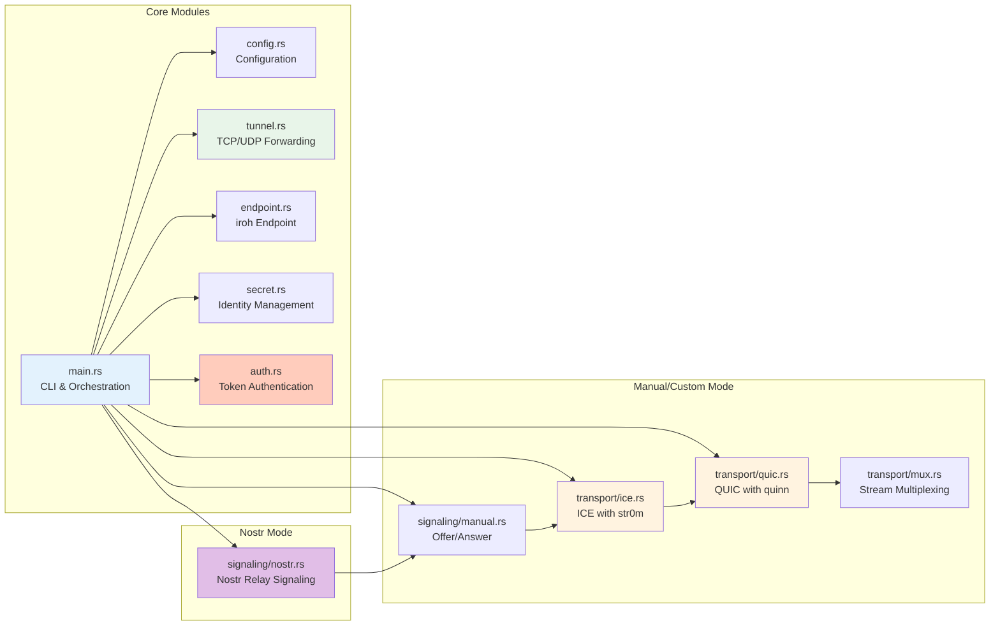

---

## Mode Comparison

> **Tip for Containerized Environments:** Use `iroh` mode for Docker, Kubernetes, and cloud VM deployments. It includes relay fallback which ensures connectivity even when both peers are behind restrictive NATs (common in cloud environments). The `nostr` and `manual` modes use STUN-only NAT traversal which may fail in these environments.

### Feature Matrix

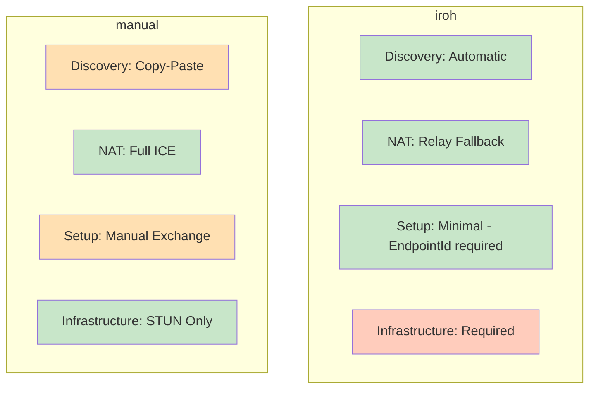

### NAT Traversal Capabilities

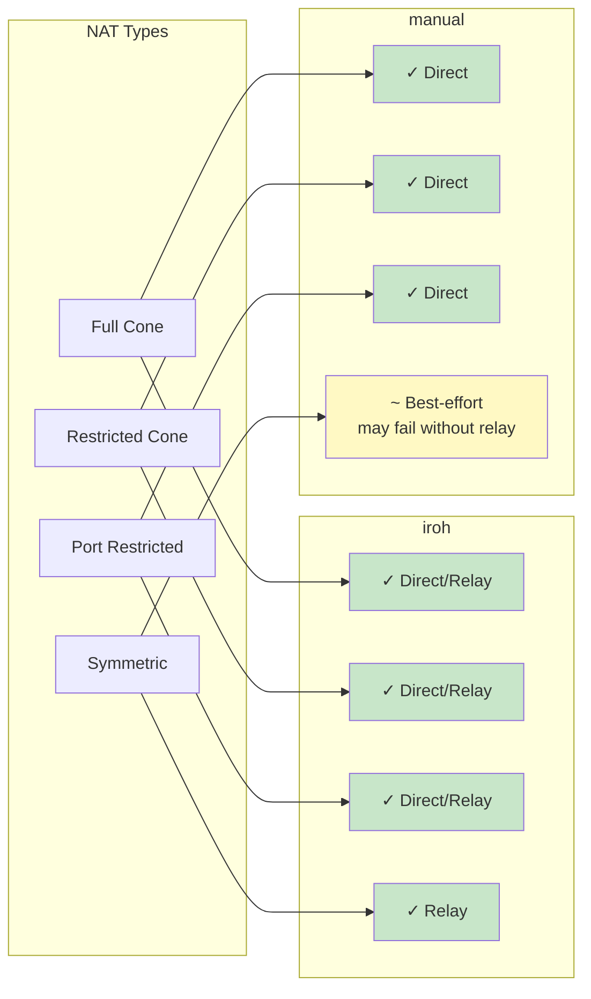

---

## Mode-Specific Architecture

Detailed architecture for each mode lives in separate documents:

- Port Forwarding (iroh, manual, nostr): `docs/ARCHITECTURE-PORT-FORWARDING.md`
- VPN (TUN + NAT64): `docs/ARCHITECTURE-VPN.md`

## Configuration System

### Configuration File Structure

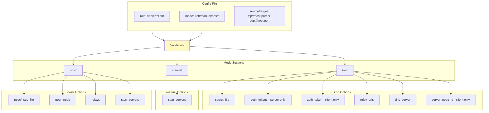

### Configuration Loading Flow

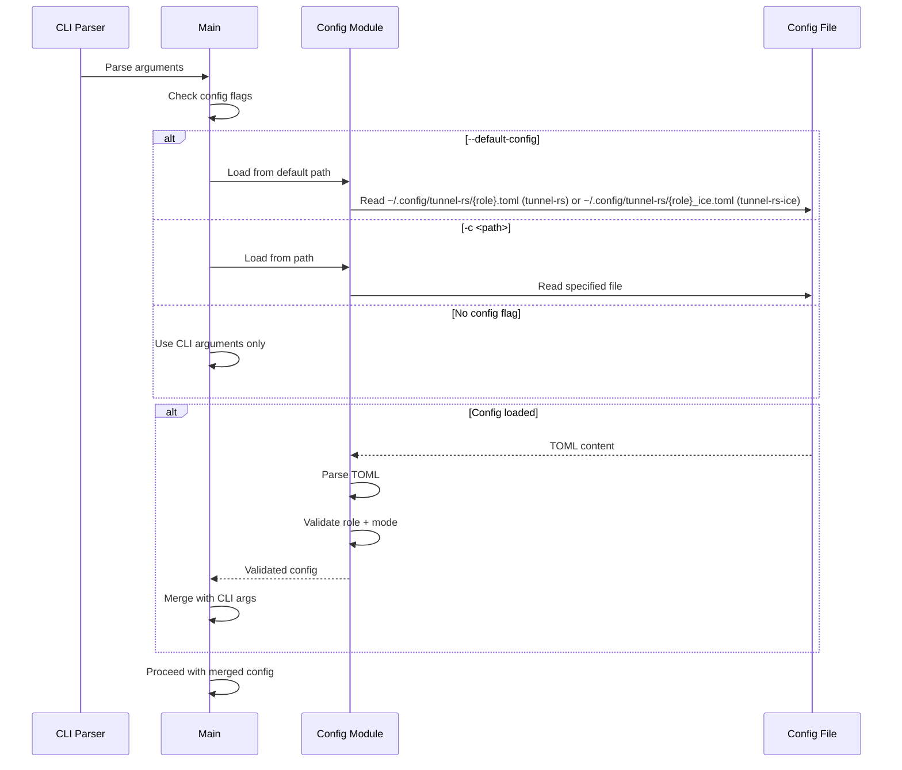

Note: For `tunnel-rs-ice`, the mode is inferred from the config file, so `server -c <file>` / `client -c <file>` can be used without a subcommand.

### Config Validation

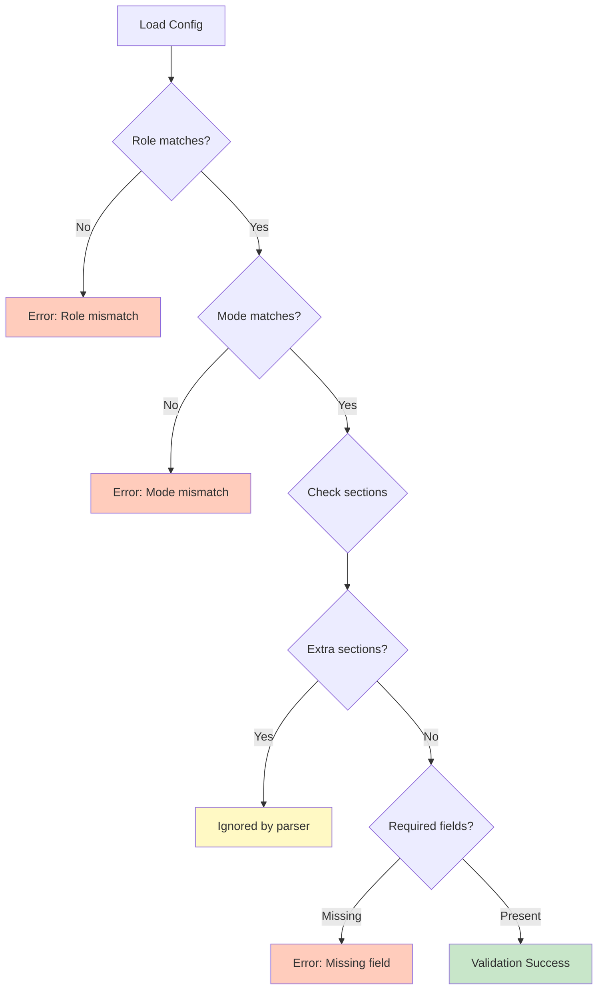

---

## Security Model

### Encryption Stack

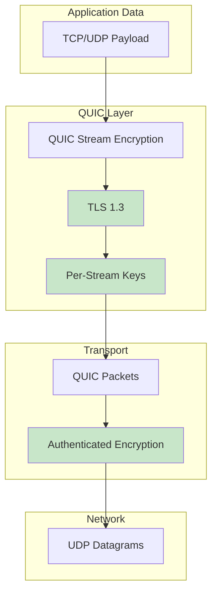

### Identity and Authentication

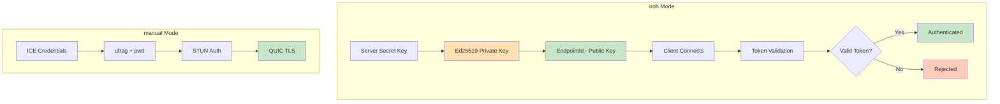

### Token Authentication (iroh Mode)

Iroh mode requires authentication using pre-shared tokens. Clients use ephemeral identities but must provide a valid token. **Authentication is mandatory and must complete successfully before any source requests are permitted.** The client must authenticate via a dedicated auth stream with a valid token within a 10-second timeout immediately after QUIC connection establishment.

1. **Server Configuration**: Server specifies `--auth-tokens` with one or more pre-shared tokens
2. **Client Configuration**: Client specifies `--auth-token` with the token received from the server admin
3. **Protocol Flow**: Client opens a dedicated auth stream immediately after connection and sends an `AuthRequest`. **No source requests are accepted until authentication succeeds.**
4. **Validation**: Server validates the token using `is_token_valid()` within a 10-second timeout
5. **Rejection**: Invalid tokens receive an `AuthResponse::rejected()` and the connection is closed immediately

This early validation prevents unauthorized clients from holding open connections or attempting source requests.

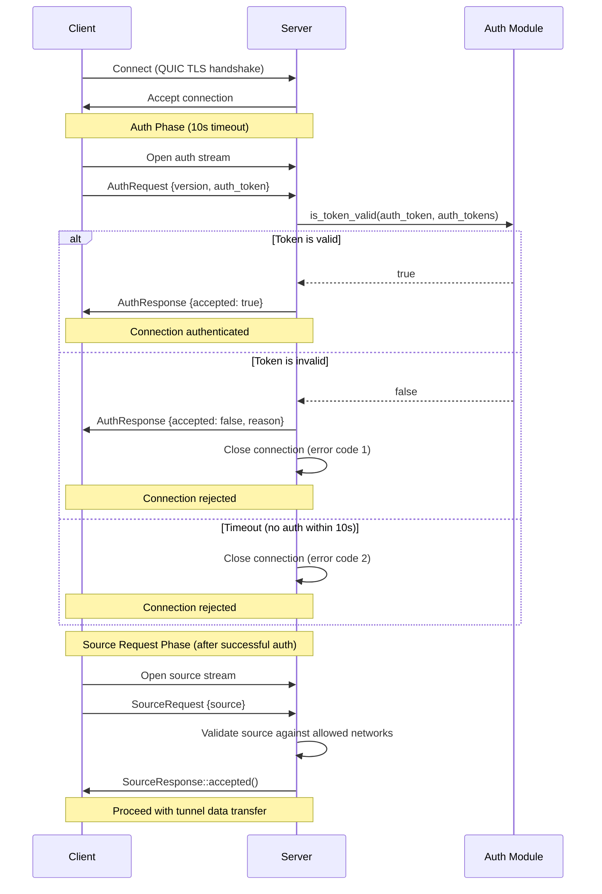

### Token Security Notes (iroh Mode)

- Tokens are **bearer credentials**: possession is sufficient for access. Use one token per client to enable revocation.
- Token strength comes from **randomness, not format**: 16 random characters from a 65‑symbol alphabet (~96 bits of entropy). Treat tokens like high‑entropy secrets.
- Tokens are sent only **after** the QUIC/TLS 1.3 handshake, so the auth stream is encrypted in transit.
- The checksum is **for typo detection only**, not cryptographic security.
- Tokens are validated as ASCII and limited to safe characters to avoid shell/TOML parsing issues.
- Avoid logging or sharing tokens; the `AuthToken` wrapper redacts values in Debug output, but treat them like passwords.
- Prefer token files with restricted permissions (e.g., `0600`) and rotate tokens if exposure is suspected.

### Threat Model

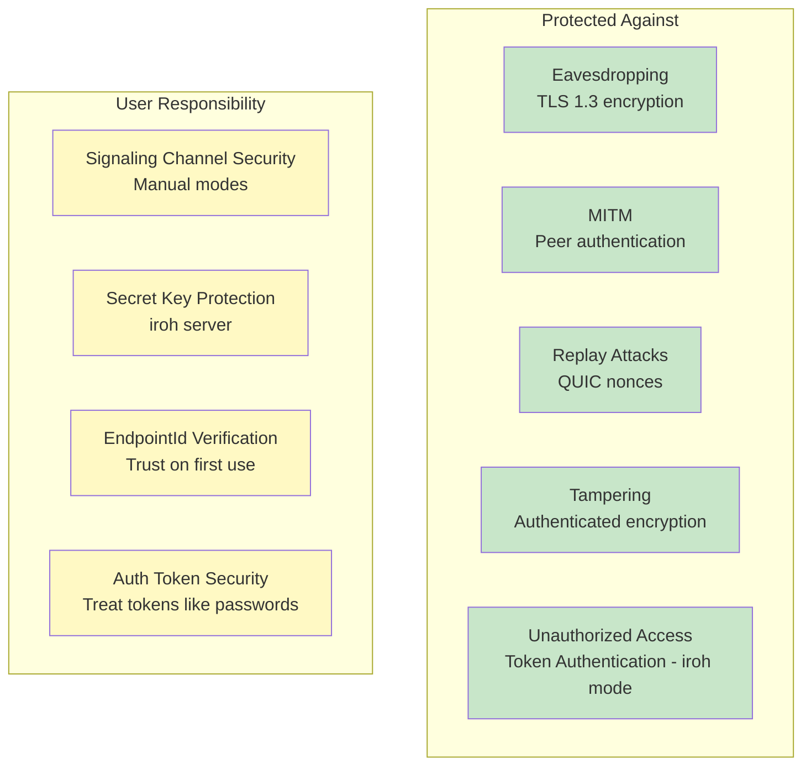

### Secret Key Management (Server Only)

In iroh mode, only the **server** needs a persistent secret key to maintain a stable EndpointId. Clients use ephemeral identities and authenticate via tokens.

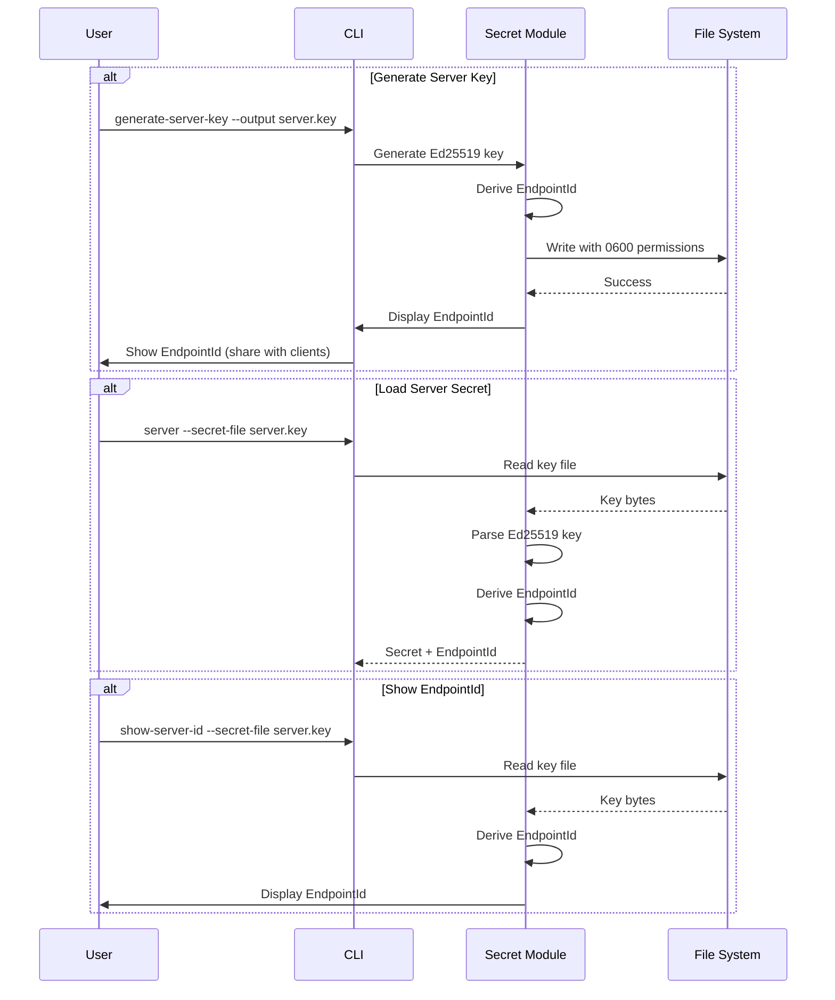

---

## Protocol Support

### TCP Tunneling Architecture

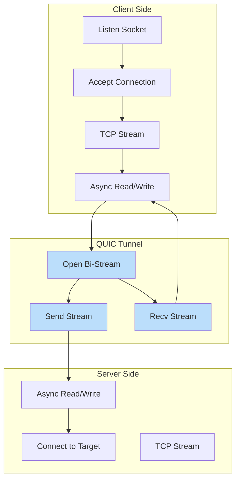

### UDP Tunneling Architecture

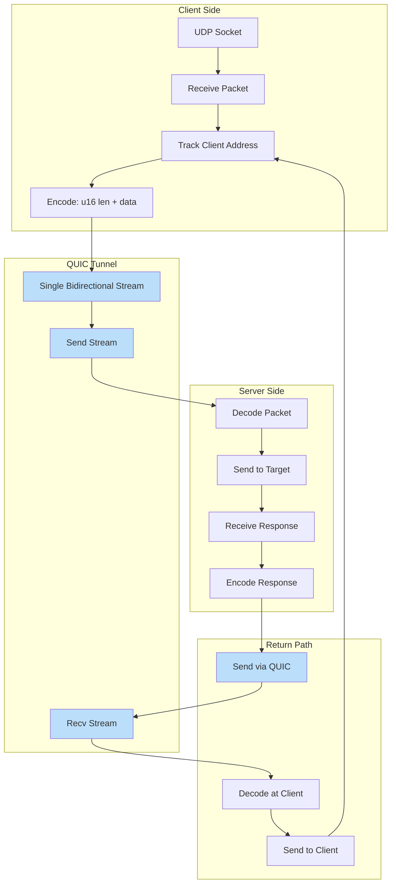

### UDP Packet Framing

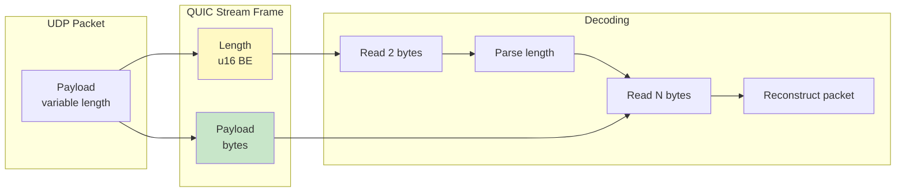

---

## Component Details

### IceAgent (str0m)

The `IceAgent` from str0m handles ICE connectivity establishment:

- **Candidate Gathering**: Discovers local and server-reflexive addresses
- **Connectivity Checks**: Performs STUN binding checks to all candidate pairs
- **Nomination**: Selects the best working candidate pair
- **Socket Management**: Provides the UDP socket for QUIC transport

### QUIC Endpoint (quinn)

The `quinn` QUIC implementation provides:

- **TLS 1.3**: Encrypted transport with certificate-based auth
- **Stream Multiplexing**: Multiple concurrent streams over one connection
- **Congestion Control**: Built-in congestion control and flow control
- **0-RTT**: Not currently enabled (future optimization)

### Endpoint (iroh)

The `iroh::Endpoint` provides:

- **Discovery**: Automatic peer discovery via Pkarr/DNS/mDNS
- **Relay**: Fallback relay servers for NAT traversal
- **QUIC**: Built-in QUIC transport with hole punching
- **Identity**: Ed25519-based peer identity and authentication

---

## Performance Considerations

### Connection Establishment Times

> **Note:** These are illustrative, environment-dependent ranges (network conditions, NAT type, relay availability, and DNS). Treat as rough guidance, not guarantees.

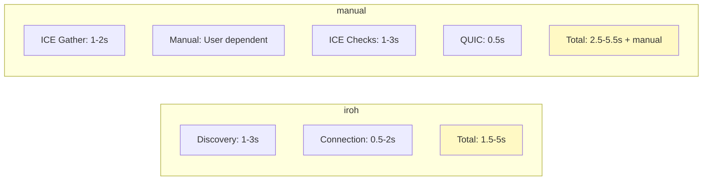

### Throughput Characteristics

- **TCP Tunneling**: Limited by QUIC stream flow control and congestion control
- **UDP Tunneling**: Additional framing overhead (2 bytes per packet)
- **Relay Mode**: Higher latency, potentially lower throughput
- **Direct Mode**: Near-native performance with encryption overhead

---

## Error Handling

### Connection Failures

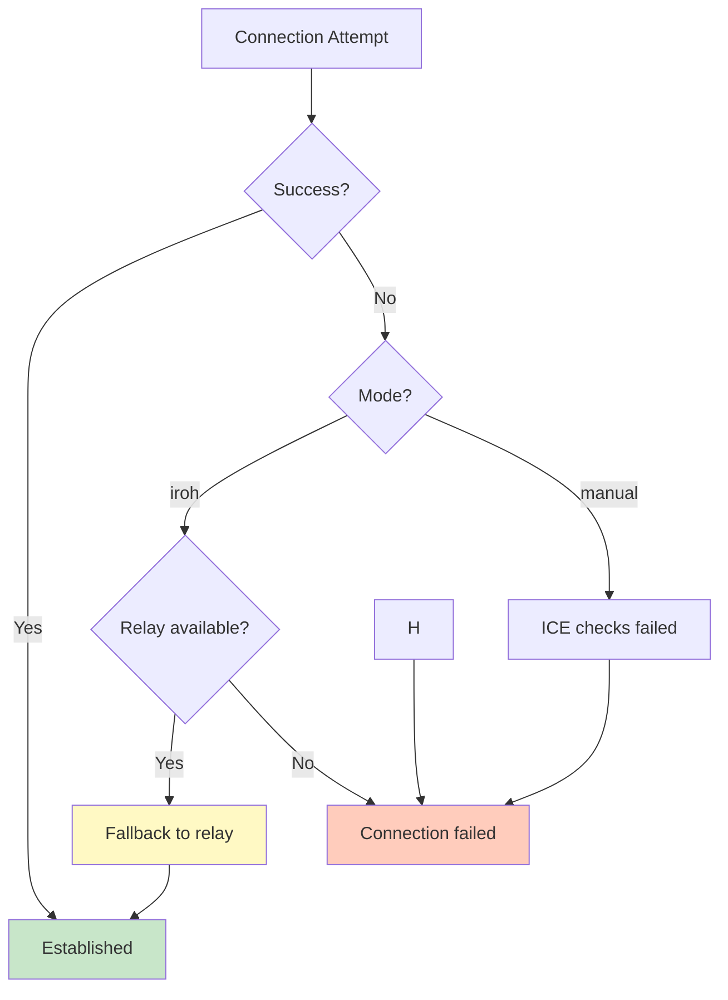

### Stream Errors

- **TCP**: Connection reset, timeout → close QUIC stream
- **UDP**: Packet loss → no retry (UDP semantics preserved)
- **QUIC**: Stream reset → close local TCP connection or stop UDP forwarding

---

## Mode Capabilities

| Mode | Multi-Session | Dynamic Source | Encryption | Platform |
|------|---------------|----------------|------------|----------|
| `iroh` | **Yes** | **Yes** | QUIC/TLS 1.3 | Linux, macOS, Windows |
| `vpn` (iroh) | **Yes** | N/A (full tunnel) | QUIC (TLS 1.3) | Linux, macOS, Windows |
| `nostr` | **Yes** | **Yes** | QUIC/TLS 1.3 | Linux, macOS, Windows |
| `manual` | No | **Yes** | QUIC/TLS 1.3 | Linux, macOS, Windows |

**Multi-Session** = Multiple concurrent connections to the same server
**Dynamic Source** = Client specifies which service to tunnel (via `--source`)
**VPN Mode** = Full network tunneling with automatic IP assignment (no per-port config)

---

## Current Limitations

### Single Session (Manual Signaling Mode)

The `manual` mode currently supports only one tunnel session at a time per server instance. Each signaling exchange establishes exactly one tunnel.

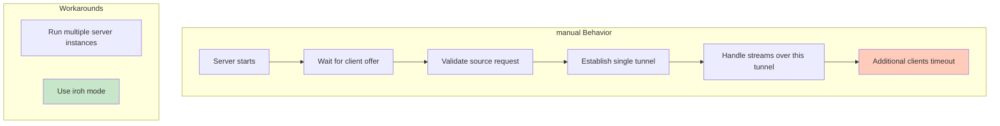

**Why this limitation exists:**
- Manual signaling mode performs a single offer/answer exchange
- The server enters a connection handling loop after establishing the tunnel
- No mechanism to accept additional signaling while serving existing tunnel

**Workarounds:**
- Use `iroh` mode for multi-client support
- Run separate server instances for each tunnel

See [Roadmap](ROADMAP.md) for planned multi-session support.

---

## References

- [iroh Documentation](https://iroh.computer/)
- [str0m ICE Implementation](https://github.com/algesten/str0m)
- [quinn QUIC Implementation](https://github.com/quinn-rs/quinn)
- [RFC 8445 - ICE](https://datatracker.ietf.org/doc/html/rfc8445)
- [RFC 9000 - QUIC](https://datatracker.ietf.org/doc/html/rfc9000)
